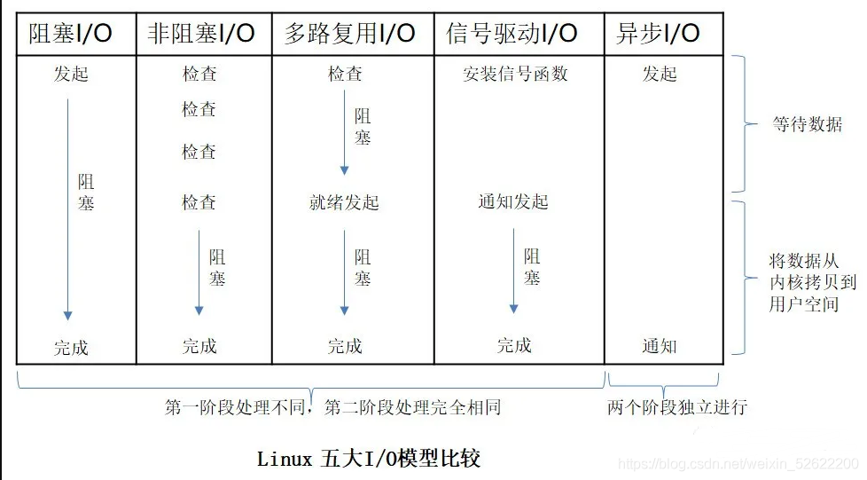
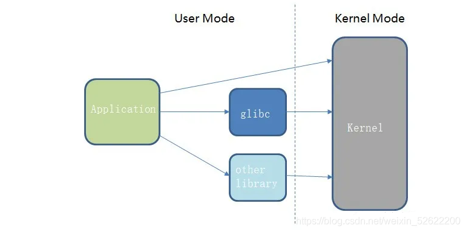
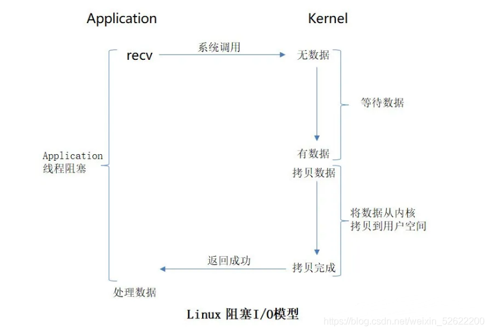
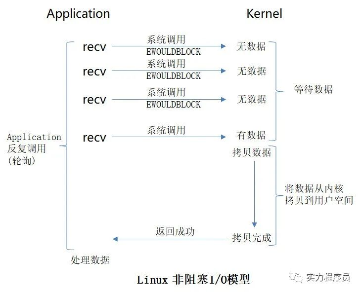
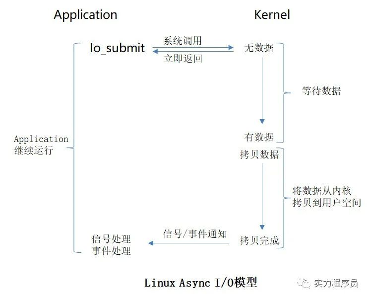
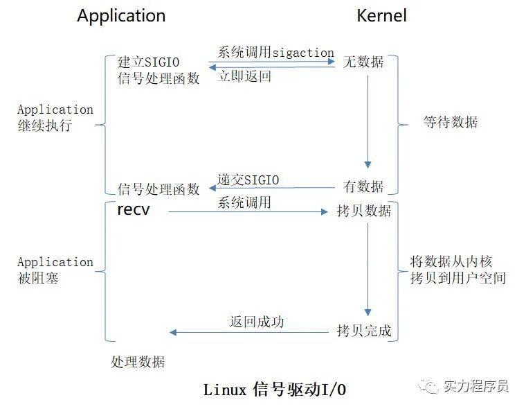
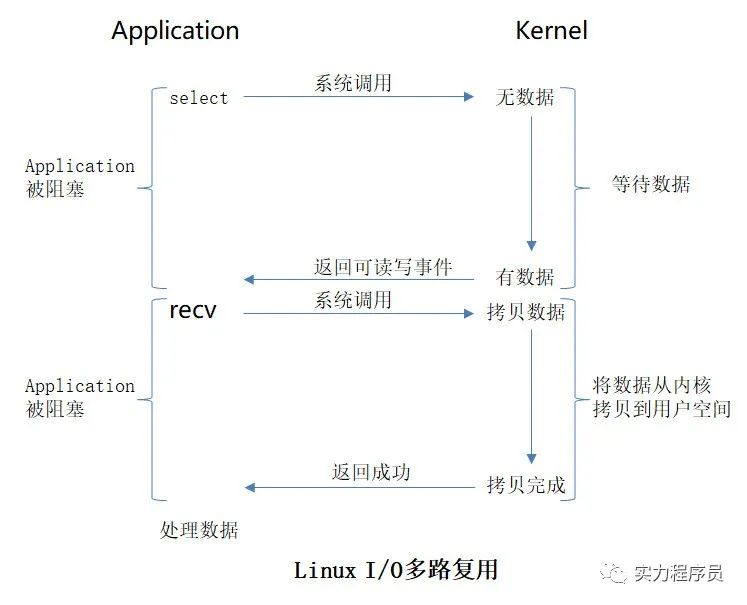

Linux下，一个应用程序调用操作系统提供的服务，主要的调用接口有如下三种：

- 直接调用Linux 内核(Kernel) 提供的系统调用(Sys call)接口
- 调用glibc封装的api，glibc内部会调用kernel
- 调用其它第三方library的api，这些library 内部会调用kernel

Linux kernel 的代码，cpu以Ring0级别运行，运行空间叫做内核态(Kernel Mode)；用户及library的代码，cpu以Ring3级别运行，运行空间叫做用户态(User Mode)。因此应用程序访问系统服务的过程中，cpu会在用户态和内核态之间进行来回切换，并copy所需要的内存数据。

I/O是我们编程中经常调用的Linux服务，就是按上述接口方式进行的。常见的场景是网络I/O和文件I/O。

Linux IO的整个过程中，应用程序与内核之间有不同的交互协作方式，可以从不同的角度将其划分为阻塞(Blocking)/非阻塞(Non-blocking)、同步(Sync)/异步(Async)。

以网络IO为例，理清这些概念背后的含义，并对Linux 的五种IO模型进行介绍。

**Linux下主要有五种I/O模型：**

1. 阻塞I/O(blocking IO)
2. 非阻塞I/O (nonblocking I/O)
3. 信号驱动I/O (signal driven I/O (SIGIO))
4. I/O 多路复用 (I/O multiplexing)
5. 异步I/O (asynchronous I/O)

阻塞(Blocking IO)是指：一旦应用程序调用API接口，应用程序的线程就会被卡住，一直到IO操作完成，这个API函数才返回，这时应用程序的线程才解除阻塞状态，可以继续向下执行。

阻塞IO，用下图说明：

Application 调用 recv函数，从socket收取网络数据，从调用recv函数开始，Application的线程就立即被挂起，暂停运行，处于阻塞状态。内核收到recv请求后，会先检查socket上是否有数据，如果没有，会继续等待，直至有数据到来。当有数据时，内核会将数据从内核复制到用户空间Application提供的buffer中，完成后 recv 函数返回成功。当recv函数返回后，Application的线程解除阻塞，继续向下执行，处理buffer中收到的数据。

**非阻塞**(Non-blocking IO)是指：应用程序调用API接口，如果IO数据未准备好，则API直接返回失败；如果IO数据准备好了，那么应用程序会被阻塞，直至IO完成，API返回，应用程序解除阻塞，继续执行。

非阻塞IO，用下图说明：

将socket设置为非阻塞模式后，Application 调用 recv函数，从socket上收取网络数据。如果socket上没有数据，则recv函数会直接返回失败。因此Application需要反复调用recv函数获取数据。一旦此socket上有数据来了，recv函数就会将Application的线程阻塞住，内核执行IO操作，将数据从内核复制到用户空间Application提供的buffer中，完成后 recv 函数返回成功。当recv函数返回后，Application的线程解除阻塞，继续向下执行，处理buffer中收到的数据。

**阻塞IO与非阻塞IO的区别，只在于IO数据是否已经准备好。**如果数据未准备好，阻塞IO模式下会将Application的线程一直阻塞，而非阻塞IO会直接返回失败。当数据准备好时，二者的模式完全相同，都是将Application阻塞住，直至IO完成。

**同步IO和异步IO：**

POSIX中对这两个IO的定义如下：

A synchronous I/O operation causes the requesting process to be blocked until that I/O operation completes;

An asynchronous I/O operation does not cause the requesting process to be blocked;

两者的区别就在于**同步IO做IO operation的时候会将process阻塞，而异步IO做IO operation时不会阻塞process**。

以前面的recv函数为例，真正的IO operation是指将数据从内核空间复制到用户空间这个过程中，如果这个过程中应用程序被阻塞就叫同步IO，否则就叫异步IO。

因此，前面介绍的阻塞IO、非阻塞IO，都是同步IO。

异步IO的过程，用下图示意如下：

当应用程序发出异步IO的请求后，无论内核中数据是否准备好，API函数都会立即返回，应用程序不会被阻塞，而是继续执行其它逻辑代码。当数据到达内核，内核会将数据从内核拷贝到用户空间Application指定的buffer中，拷贝完成后用信号或事件通知应用程序。应用程序在信号处理函数或事件处理函数中获取IO操作的结果，对IO结果数据进行处理。

从应用程序角度，发出IO请求和IO结果的处理，被分割成2个独立的部分，分别进行。内核中等待数据、拷贝数据的过程，对Application没有任何影响。因此，Application和内核之间，完全是异步的关系。

**信号驱动I/O：**

首先为socket安装一个信号处理函数，进程继续运行并不阻塞。当数据准备好时，进程会收到一个SIGIO信号，可以在信号处理函数中调用I/O操作函数处理数据。整个过程如下图所示：

**I/O多路复用 (I/O multiplexing)：**

Linux下IO多路复用，主要指select、poll和epoll。一个线程可以对多个IO端口进行监听，轮询监听的socket集合中是否有事件发生，如果有事件，则进行相应的IO读写操作。

整个过程，用select 表示如下：

应用程序调用select函数，传入要监测的socket集合，然后应用程序就会被阻塞住，当这个socket集合中的一个或多个socket上有数据准备好时，select函数返回，应用程序解除阻塞。

然后应用程序可以检查这些socket集合，判断socket是可以读了，还是可以写了。如果socket上有数据可以读，则调用recv函数，从socket读取数据。recv会使application再次进入阻塞状态，直至内核将数据拷贝至用户空间application提供的buffer中，拷贝完成后，recv函数返回，Application解除阻塞，可以处理buffer中的数据。

上述过程中，select和recv，可以是由不同的线程进行的。

一个线程，可以监测多个socket的读写状态变化，并且能把实际的IO操作发给其它的多个线程来做，这就是IO多路复用的含义。

select 能监测的socket数量是受限的(用固定数组来存储socket集合)，64位OS下默认为2048个。并且其内部实现机制是对socket进行轮询扫描，因此效率不高。

poll的工作原理，与select类似，只是其数据结构换成了链接，这样socket数量不受限制，但也是轮询模式。

epoll是Linux特有的I/O多路复用方法，其内部实现采用事件通知的方式，而非轮询，只有状态发生变化的socket才会被处理，因此效率大大提高。一个epoll对象可以高效监测大量的socket连接。

epoll 中，socket可读或可写的状态变化，叫事件。可以有两种方式，将这些事件通知给应用程序，一种叫水平触发，另一种叫边缘触发。用电平在0和1之间变化的例子，来说明这两种方式：

比如，socket1对应的链路，网络对端发过来了2K数据。这时，socket1的状态就会从不可读变为可读(因为有数据可以被读取了)，无论采用水平触发还是边缘触发模式来监测socket1的读状态变化，都会收到一次事件通知。

然后应用程序就可以调用recv 来读取数据了。但应用程序并不知道对端发过来的数据究竟有多少。如果应用程序只提供1KB的buffer给recv，那么就会先读取出前1KB的数据，剩下1KB的数据还在内核中。这是如果再用epoll对socket1进行读状态监测，水平触发模式下还会监测到socket1 有可读事件发生，而边缘触发模式下则不会监测到。因为边缘触发，只能在不可读变为可读，或者可读变为不可读这样的状态翻转时才触发一次。