什么是中间件

## 1、什么是中间件

我国企业从20世纪80年代开始就逐渐进行信息化建设，由于方法和体系的不成熟，以及企业业务和市场需求的不断变化，一个企业可能同时运行着多个不同的业务系统，这些系统可能基于不同的操作系统、不同的数据库、异构的网络环境。现在的问题是，如何把这些信息系统结合成一个有机地协同工作的整体，真正实现企业跨平台、分布式应用。中间件便是解决之道，它用自己的复杂换取了企业应用的简单。

```
中间件（Middleware）是处于操作系统和应用程序之间的软件，也有人认为它应该属于操作系统中的一部分。人们在使用中间件时，往往是一组中间件集成在一起，构成一个平台（包括开发平台和运行平台），但在这组中间件中必须要有一个通信中间件，即中间件=平台+通信，这个定义也限定了只有用于分布式系统中才能称为中间件，同时还可以把它与支撑软件和实用软件区分开来。
```

举例：
1，RMI（Remote Method Invocations, 远程调用）
2，Load Balancing(负载均衡，将访问负荷分散到各个服务器中)
3，Transparent Fail-over(透明的故障切换)
4，Clustering(集群,用多个小的服务器代替大型机）
5，Back-end-Integration(后端集成，用现有的、新开发的系统如何去集成遗留的系统)
6，Transaction事务（全局/局部）全局事务（分布式事务）局部事务（在同一数据库联接内的事务）
7，Dynamic Redeployment(动态重新部署,在不停止原系统的情况下，部署新的系统）
8，System Management(系统管理)
9，Threading(多线程处理)
10，Message-oriented Middleware面向消息的中间件（异步的调用编程）
11，Component Life Cycle(组件的生命周期管理)
12，Resource pooling（资源池）
13，Security（安全）
14，Caching（缓存）

## 2、为什么需要使用消息中间件

具体地说，中间件屏蔽了底层操作系统的复杂性，使程序开发人员面对一个简单而统一的开发环境，减少程序设计的复杂性，将注意力集中在自己的业务上，不必再为程序在不同系统软件上的移植而重复工作，从而大大减少了技术上的负担。中间件带给应用系统的，不只是开发的简便、开发周期的缩短，也减少了系统的维护、运行和管理的工作量，还减少了计算机总体费用的投入。

## 3、中间件特点

为解决分布异构问题，人们提出了中间件(middleware)的概念。中间件是位于平台(硬件和操作系统)和应用之间的通用服务，如下图所示，这些服务具有标准的程序接口和协议。针对不同的操作系统和硬件平台，它们可以有符合接口和协议规范的多种实现。


也许很难给中间件一个严格的定义，但中间件应具有如下的一些特点：
（1）满足大量应用的需要
（2）运行于多种硬件和OS平台
（3）支持分布计算，提供跨网络、硬件和OS平台的透明性的应用或服务的交互
（4）支持标准的协议
（5）支持标准的接口

由于标准接口对于可移植性和标准协议对于互操作性的重要性，中间件已成为许多标准化工作的主要部分。对于应用软件开发，中间件远比操作系统和网络服务更为重要，中间件提供的程序接口定义了一个相对稳定的高层应用环境，不管底层的计算机硬件和系统软件怎样更新换代，只要将中间件升级更新，并保持中间件对外的接口定义不变，应用软件几乎不需任何修改，从而保护了企业在应用软件开发和维护中的重大投资。

> 简单说：中间件有个很大的特点，是脱离于具体设计目标，而具备提供普遍独立功能需求的模块。这使得中间件一定是可替换的。如果一个系统设计中，中间件是不可替换的，不是架构、框架设计有问题，那么就是这个中间件，在 别处可能是个中间件，在这个系统内是引擎。哈。

## 4、在项目中什么时候使用中间件技术

在项目的架构和重构中，使用任何技术和架构的改变我们都需要谨慎斟酌和思考，因为任何技术的融入和变化都可能人员，技术，和成本的增加，中间件的技术一般现在一些互联网公司或者项目中使用比较多，如果你仅仅还只是一个初创公司建议还是使用单体架构，最多加个缓存中间件即可，不要盲目追求新或者所谓的高性能，而追求的背后一定是业务的驱动和项目的驱动，因为一旦追求就意味着你的学习成本，公司的人员结构以及服务器成本，维护和运维的成本都会增加，所以需要谨慎选择和考虑。

但是作为一个开放人员，一定要有学习中间件技术的能力和思维，否则很容易当项目发展到一个阶段在去掌握估计或者在面试中提及，就会给自己带来不小的困扰，在当今这个时代这些技术也并不是什么新鲜的东西，如果去掌握和挖掘最关键的还是自己花时间和花精力去探讨和研究。

## 5、课程的规划和安排

- 消息中间件 ActiveMQ
- 消息中间件 RabbitMQ
- 消息中间件 Kafaka
- 消息中间件 RocketMQ
- 消息中间件应用场景说明
- 负载均衡中间件(Nginx/Lvs)
- 缓存中间件(Memcache/Redis)
- 数据库中间件(ShardingJdbc/Mycat)

# 中间件技术及架构的概述

知识图谱


## 01、学习中间件的方式和技巧

1：理解中间件在项目架构中的作用，以及各中间件的底层实现。
2：可以使用一些类比的生活概念去理解中间件，
3：使用一些流程图或者脑图的方式去梳理各个中间件在架构中的作用
4：尝试用java技术去实现中间件的远离
5：静下来去思考中间件在项目中设计的和使用的原因
6：如果找到对应的替代总结方案
7：尝试编写博文总结类同中间件技术的对比和使用场景。
8：学会查看中间件的源码以及开开源项目和博文。

## 02、学习目标

- 什么是消息中间件
- 什么是协议
- 什么是持久化
- 消息分发
- 消息的高可用
- 消息的集群
- 消息的容错
- 消息的冗余

## 03、什么是消息中间件

在实际的项目中，大部分的企业项目开发中，在早期都采用的是单体的架构模式，如下图：


## 04、单体架构

在企业开发的中，大部分的初期架构都采用的是单体架构的模式进行架构，而这种架构的典型的特点：就是把所有的业务和模块，源代码，静态资源文件等都放在一个一工程中，如果其中的一个模块升级或者迭代发生一个很小变动都会重新编译和重新部署项目。 这种的架构存在的问题就是：
1：耦合度太高
2：运维的成本过高
3：不易维护
4：服务器的成本高
5：以及升级架构的复杂度也会增大
这样就有后续的分布式架构系统。如下

## 05、分布式架构

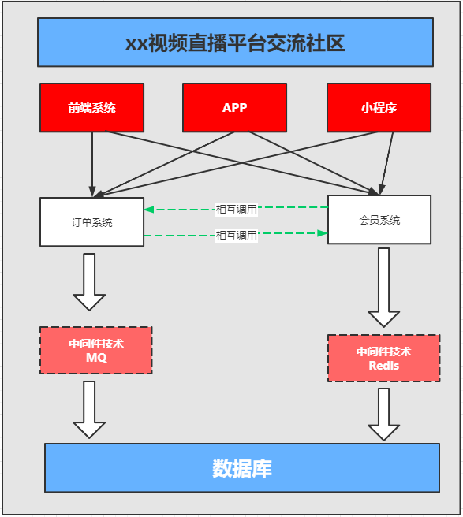

何谓分布式系统呢：

> 通俗一点：就是一个请求由服务器端的多个服务（服务或者系统）协同处理完成

和单体架构不同的是，单体架构是一个请求发起jvm调度线程（确切的是tomcat线程池）分配线程Thread来处理请求直到释放，而分布式是系统是：一个请求是由多个系统共同来协同完成，jvm和环境都可能是独立。如果生活中的比喻的话，单体架构就想建设一个小房子很快就能够搞定，如果你要建设一个鸟巢或者大型的建筑，你就必须是各个环节的协同和分布，这样目的也是项目发展都后期的时候要去部署和思考的问题。我们也不能看出来：分布式架构系统存在的特点和问题如下：

**存在问题**
1：学习成本高，技术栈过多
2：运维成本和服务器成本增高
3：人员的成本也会增高
4：项目的负载度也会上升
5：面临的错误和容错性也会成倍增加
6：占用的服务器端口和通讯的选择的成本高
7：安全性的考虑和因素逼迫可能选择RMI/MQ相关的服务器端通讯。

**好处**
1：服务系统的独立，占用的服务器资源减少和占用的硬件成本减少，
确切的说是：可以合理的分配服务资源，不造成服务器资源的浪费
2：系统的独立维护和部署，耦合度降低，可插拔性。
3：系统的架构和技术栈的选择可以变的灵活（而不是单纯的选择java）
4：弹性的部署，不会造成平台因部署造成的瘫痪和停服的状态。

## 06、小结

# 基于消息中间件的分布式系统的架构

## 01、基于消息中间件的分布式系统的架构


从上图中可以看出来，消息中间件的是
1：利用可靠的消息传递机制进行系统和系统直接的通讯
2：通过提供消息传递和消息的排队机制，它可以在分布式系统环境下扩展进程间的通讯。

## 02、消息中间件应用的场景

1:跨系统数据传递
2:高并发的流量削峰
3:数据的分发和异步处理
4:大数据分析与传递
5:分布式事务
比如你有一个数据要进行迁移或者请求并发过多的时候，比如你有10W的并发请求下订单，我们可以在这些订单入库之前，我们可以把订单请求堆积到消息队列中，让它稳健可靠的入库和执行。

## 03、常见的消息中间件

ActiveMQ、RabbitMQ、Kafka、RocketMQ等。

## 04、消息中间件的本质及设计

它是一种接受数据，接受请求、存储数据、发送数据等功能的技术服务。

> MQ消息队列：负责数据的传接受，存储和传递，所以性能要过于普通服务和技术。


谁来生产消息，存储消息和消费消息呢？


## 05、消息中间件的核心组成部分

1：消息的协议
2：消息的持久化机制
3：消息的分发策略
4：消息的高可用，高可靠
5：消息的容错机制

## 06、小结

其实不论选择单体架构还是分布式架构都是项目开发的一个阶段，在什么阶段选择适合的架构方式，而不能盲目追求，最后造成的后果和问题都需要自己买单。但是作为一个开发人员学习和探讨新的技术是我们每个程序开发者都应该去保持和思考的问题。当我们没办法去改变社会和世界的时候，我们为了生活和生存那就必须要迎合企业和市场的需求，发挥你的价值和所学的才能，创造价值和实现自我。

# 消息队列协议

## 01、什么是协议


我们知道消息中间件负责数据的传递，存储，和分发消费三个部分，数据的存储和分发的过程中肯定要遵循某种约定成俗的规范，你是采用底层的TCP/IP，UDP协议还是其他的自己取构建等，而这些约定成俗的规范就称之为：协议。

> 所谓协议是指：
> 1：计算机底层操作系统和应用程序通讯时共同遵守的一组约定，只有遵循共同的约定和规范，系统和底层操作系统之间才能相互交流。
> 2：和一般的网络应用程序的不同它主要负责数据的接受和传递，所以性能比较的高。
> 3：协议对数据格式和计算机之间交换数据都必须严格遵守规范。

## 02、网络协议的三要素

1.语法。语法是用户数据与控制信息的结构与格式,以及数据出现的顺序。
2.语义。语义是解释控制信息每个部分的意义。它规定了需要发出何种控制信息,以及完成的动作与做出什么样的响应。
3.时序。时序是对事件发生顺序的详细说明。

比如我MQ发送一个信息，是以什么数据格式发送到队列中，然后每个部分的含义是什么，发送完毕以后的执行的动作，以及消费者消费消息的动作，消费完毕的响应结果和反馈是什么，然后按照对应的执行顺序进行处理。如果你还是不理解：大家每天都在接触的http请求协议:

> 1：语法：http规定了请求报文和响应报文的格式。
> 2：语义：客户端主动发起请求称之为请求。（这是一种定义，同时你发起的是post/get请求）
> 3：时序：一个请求对应一个响应。（一定先有请求在有响应，这个是时序）

而消息中间件采用的并不是http协议，而常见的消息中间件协议有：OpenWire、AMQP、MQTT、Kafka，OpenMessage协议。

> **面试题：为什么消息中间件不直接使用http协议呢？**
> 1: 因为http请求报文头和响应报文头是比较复杂的，包含了cookie，数据的加密解密，状态码，响应码等附加的功能，但是对于一个消息而言，我们并不需要这么复杂，也没有这个必要性，它其实就是负责数据传递，存储，分发就行，一定要追求的是高性能。尽量简洁，快速。
> 2:大部分情况下http大部分都是短链接，在实际的交互过程中，一个请求到响应很有可能会中断，中断以后就不会就行持久化，就会造成请求的丢失。这样就不利于消息中间件的业务场景，因为消息中间件可能是一个长期的获取消息的过程，出现问题和故障要对数据或消息就行持久化等，目的是为了保证消息和数据的高可靠和稳健的运行。

## 03：AMQP协议

AMQP：(全称：Advanced Message Queuing Protocol) 是高级消息队列协议。由摩根大通集团联合其他公司共同设计。是一个提供统一消息服务的应用层标准高级消息队列协议，是应用层协议的一个开放标准，为面向消息的中间件设计。基于此协议的客户端与消息中间件可传递消息，并不受客户端/中间件不同产品，不同的开发语言等条件的限制。Erlang中的实现有RabbitMQ等。
特性：
1：分布式事务支持。
2：消息的持久化支持。
3：高性能和高可靠的消息处理优势。

AMQP协议的支持者：


## 04：MQTT协议

MQTT协议：（Message Queueing Telemetry Transport）消息队列是IBM开放的一个即时通讯协议，物联网系统架构中的重要组成部分。
特点：
1：轻量
2：结构简单
3：传输快，不支持事务
4：没有持久化设计。
应用场景：
1：适用于计算能力有限
2：低带宽
3：网络不稳定的场景。
支持者：


## 05、OpenMessage协议


是近几年由阿里、雅虎和滴滴出行、Stremalio等公司共同参与创立的分布式消息中间件、流处理等领域的应用开发标准。
特点：
1：结构简单
2：解析速度快
3：支持事务和持久化设计。

## 06、Kafka协议


Kafka协议是基于TCP/IP的二进制协议。消息内部是通过长度来分割，由一些基本数据类型组成。
特点是：
1：结构简单
2：解析速度快
3：无事务支持
4：有持久化设计

## 07、小结

协议：是在tcp/ip协议基础之上构建的一种约定成俗的规范和机制、它的主要目的可以让客户端（应用程序 java，go）进行沟通和通讯。并且这种协议下规范必须具有持久性，高可用，高可靠的性能。

# 消息队列持久化


## 01、持久化

简单来说就是将数据存入磁盘，而不是存在内存中随服务器重启断开而消失，使数据能够永久保存。


## 02、常见的持久化方式

|          | ActiveMQ | RabbitMQ | Kafka | RocketMQ |
| -------- | -------- | -------- | ----- | -------- |
| 文件存储 | 支持     | 支持     | 支持  | 支持     |
| 数据库   | 支持     | /        | /     | /        |

# 消息的分发策略


## 01、消息的分发策略

MQ消息队列有如下几个角色
1：生产者
2：存储消息
3：消费者
那么生产者生成消息以后，MQ进行存储，消费者是如何获取消息的呢？一般获取数据的方式无外乎推（push）或者拉（pull）两种方式，典型的git就有推拉机制，我们发送的http请求就是一种典型的拉取数据库数据返回的过程。而消息队列MQ是一种推送的过程，而这些推机制会适用到很多的业务场景也有很多对应推机制策略。

## 02、场景分析一

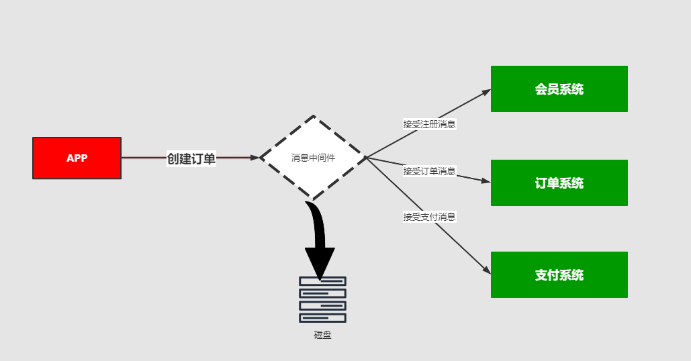

> 比如我在APP上下了一个订单，我们的系统和服务很多，我们如何得知这个消息被那个系统或者那些服务或者系统进行消费，那这个时候就需要一个分发的策略。这就需要消费策略。或者称之为消费的方法论。

## 03、场景分析二


> 在发送消息的过程中可能会出现异常，或者网络的抖动，故障等等因为造成消息的无法消费，比如用户在下订单，消费MQ接受，订单系统出现故障，导致用户支付失败，那么这个时候就需要消息中间件就必须支持消息重试机制策略。也就是支持：出现问题和故障的情况下，消息不丢失还可以进行重发。

## 04、消息分发策略的机制和对比

|          | ActiveMQ | RabbitMQ | Kafka | RocketMQ |
| -------- | -------- | -------- | ----- | -------- |
| 发布订阅 | 支持     | 支持     | 支持  | 支持     |
| 轮询分发 | 支持     | 支持     | 支持  | /        |
| 公平分发 | /        | 支持     | 支持  | /        |
| 重发     | 支持     | 支持     | /     | 支持     |
| 消息拉取 | /        | 支持     | 支持  | 支持     |

# 消息队列高可用和高可靠


## 01、什么是高可用机制

所谓高可用：是指产品在规定的条件和规定的时刻或时间内处于可执行规定功能状态的能力。
当业务量增加时，请求也过大，一台消息中间件服务器的会触及硬件（CPU,内存，磁盘）的极限，一台消息服务器你已经无法满足业务的需求，所以消息中间件必须支持集群部署。来达到高可用的目的。

### 02、集群模式1 - Master-slave主从共享数据的部署方式


解说：生产者讲消费发送到Master节点，所有的都连接这个消息队列共享这块数据区域，Master节点负责写入，一旦Master挂掉，slave节点继续服务。从而形成高可用，

### 03、集群模式2 - Master- slave主从同步部署方式


解释：这种模式写入消息同样在Master主节点上，但是主节点会同步数据到slave节点形成副本，和zookeeper或者redis主从机制很类同。这样可以达到负载均衡的效果，如果消费者有多个这样就可以去不同的节点就行消费，以为消息的拷贝和同步会暂用很大的带宽和网络资源。在后续的rabbtmq中会有使用。

### 04、集群模式3 - 多主集群同步部署模式


解释：和上面的区别不是特别的大，但是它的写入可以往任意节点去写入。

### 05、集群模式4 - 多主集群转发部署模式

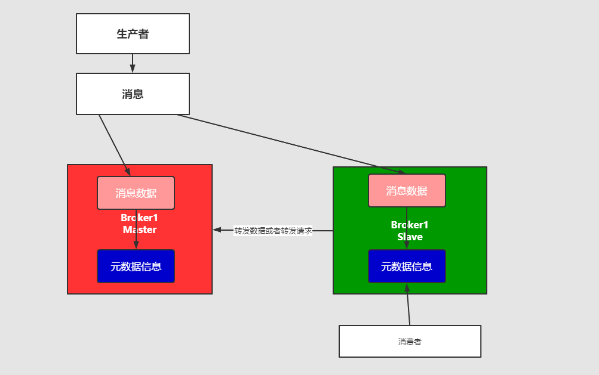

解释：如果你插入的数据是broker-1中，元数据信息会存储数据的相关描述和记录存放的位置（队列）。
它会对描述信息也就是元数据信息就行同步，如果消费者在broker-2中进行消费，发现自己几点没有对应的消息，可以从对应的元数据信息中去查询，然后返回对应的消息信息，场景：比如买火车票或者黄牛买演唱会门票，比如第一个黄牛有顾客说要买的演唱会门票，但是没有但是他会去联系其他的黄牛询问，如果有就返回。

### 06、集群模式5 Master-slave与Breoker-cluster组合的方案


解释：实现多主多从的热备机制来完成消息的高可用以及数据的热备机制，在生产规模达到一定的阶段的时候，这种使用的频率比较高。

这么集群模式，具体在后续的课程中会进行一个分析和讲解。他们的最终目的都是为保证：消息服务器不会挂掉，出现了故障依然可以抱着消息服务继续使用。

反正终归三句话：
1：要么消息共享，
2：要么消息同步
3：要么元数据共享

## 07、什么是高可靠机制

所谓高可用是指：是指系统可以无故障低持续运行，比如一个系统突然崩溃，报错，异常等等并不影响线上业务的正常运行，出错的几率极低，就称之为：高可靠。
在高并发的业务场景中，如果不能保证系统的高可靠，那造成的隐患和损失是非常严重的。
如何保证中间件消息的可靠性呢？可以从两个方面考虑：
1：消息的传输：通过协议来保证系统间数据解析的正确性。
2：消息的存储可靠：通过持久化来保证消息的可靠性。


# RabbitMQ入门及安装


## 01、概述

官网：https://www.rabbitmq.com/
什么是RabbitMQ,官方给出来这样的解释：

> RabbitMQ is the most widely deployed open source message broker.
> With tens of thousands of users, RabbitMQ is one of the most popular open source message brokers. From T-Mobile to Runtastic, RabbitMQ is used worldwide at small startups and large enterprises.
> RabbitMQ is lightweight and easy to deploy on premises and in the cloud. It supports multiple messaging protocols. RabbitMQ can be deployed in distributed and federated configurations to meet high-scale, high-availability requirements.
> RabbitMQ runs on many operating systems and cloud environments, and provides a wide range of developer tools for most popular languages.
> 翻译以后：
> RabbitMQ是部署最广泛的开源消息代理。
> RabbitMQ拥有成千上万的用户，是最受欢迎的开源消息代理之一。从T-Mobile 到Runtastic，RabbitMQ在全球范围内的小型初创企业和大型企业中都得到使用。
> RabbitMQ轻巧，易于在内部和云中部署。它支持多种消息传递协议。RabbitMQ可以部署在分布式和联合配置中，以满足大规模，高可用性的要求。
> RabbitMQ可在许多操作系统和云环境上运行，并为大多数流行语言提供了广泛的开发人员工具。

简单概述：
RabbitMQ是一个开源的遵循AMQP协议实现的基于Erlang语言编写，支持多种客户端（语言）。用于在分布式系统中存储消息，转发消息，具有高可用，高可扩性，易用性等特征。

## 02、安装RabbitMQ

1：下载地址：https://www.rabbitmq.com/download.html
2：环境准备：CentOS7.x+ / Erlang
RabbitMQ是采用Erlang语言开发的，所以系统环境必须提供Erlang环境，第一步就是安装Erlang。

> erlang和RabbitMQ版本的按照比较: https://www.rabbitmq.com/which-erlang.html
> 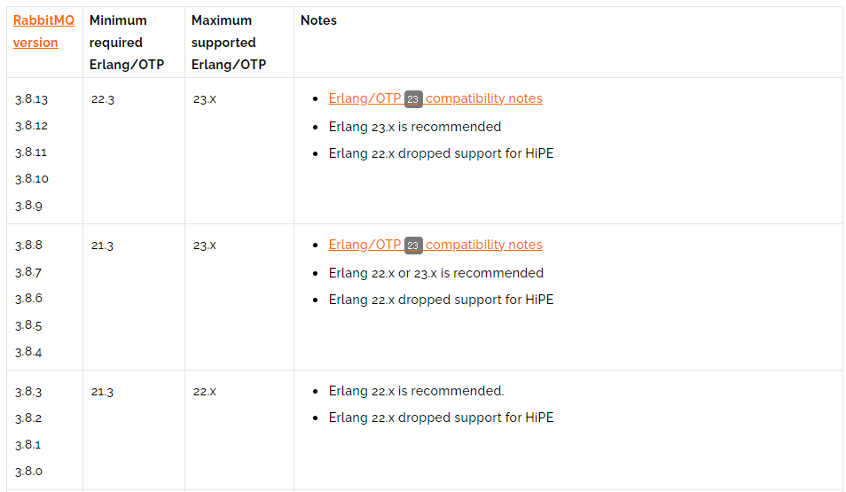

## 03、 Erlang安装

查看系统版本号

```bash
[root@iZm5eauu5f1ulwtdgwqnsbZ ~]# lsb_release -a
LSB Version:    :core-4.1-amd64:core-4.1-noarch
Distributor ID: CentOS
Description:    CentOS Linux release 8.3.2011
Release:        8.3.2011
Codename:       n/a
```

#### 3-1:安装下载

参考地址：https://www.erlang-solutions.com/downloads/

```bash
wget https://packages.erlang-solutions.com/erlang-solutions-2.0-1.noarch.rpm
rpm -Uvh erlang-solutions-2.0-1.noarch.rpm
```

#### 3-2：安装成功

```bash
yum install -y erlang
```

#### 3-3：安装成功

```bash
erl -v
```

## 04、安装socat

```bash
yum install -y socat
```

### 05、安装rabbitmq

下载地址：https://www.rabbitmq.com/download.html


#### 5-1:下载rabbitmq

```bash
> wget https://github.com/rabbitmq/rabbitmq-server/releases/download/v3.8.13/rabbitmq-server-3.8.13-1.el8.noarch.rpm
> rpm -Uvh rabbitmq-server-3.8.13-1.el8.noarch.rpm
```

#### 5-2:启动rabbitmq服务

```bash
# 启动服务
> systemctl start rabbitmq-server
# 查看服务状态
> systemctl status rabbitmq-server
# 停止服务
> systemctl stop rabbitmq-server
# 开机启动服务
> systemctl enable rabbitmq-server
```

## 06、RabbitMQ的配置

RabbitMQ默认情况下有一个配置文件，定义了RabbitMQ的相关配置信息，默认情况下能够满足日常的开发需求。如果需要修改需要，需要自己创建一个配置文件进行覆盖。
参考官网：
1:https://www.rabbitmq.com/documentation.html
2:https://www.rabbitmq.com/configure.html
3:https://www.rabbitmq.com/configure.html#config-items
4：https://github.com/rabbitmq/rabbitmq-server/blob/add-debug-messages-to-quorum_queue_SUITE/docs/rabbitmq.conf.example

### 06-1、相关端口

> 5672:RabbitMQ的通讯端口
> 25672:RabbitMQ的节点间的CLI通讯端口是
> 15672:RabbitMQ HTTP_API的端口，管理员用户才能访问，用于管理RabbitMQ,需要启动Management插件。
> 1883，8883：MQTT插件启动时的端口。
> 61613、61614：STOMP客户端插件启用的时候的端口。
> 15674、15675：基于webscoket的STOMP端口和MOTT端口

一定要注意：RabbitMQ 在安装完毕以后，会绑定一些端口，如果你购买的是阿里云或者腾讯云相关的服务器一定要在安全组中把对应的端口添加到防火墙。

# RabbitMQWeb管理界面及授权操作


## 01、RabbitMQ管理界面

### 01-1：默认情况下，rabbitmq是没有安装web端的客户端插件，需要安装才可以生效

```bash
rabbitmq-plugins enable rabbitmq_management
```

> 说明：rabbitmq有一个默认账号和密码是：`guest` 默认情况只能在localhost本机下访问，所以需要添加一个远程登录的用户。

### 01-2：安装完毕以后，重启服务即可

```bash
systemctl restart rabbitmq-server
```

> 一定要记住，在对应服务器(阿里云，腾讯云等)的安全组中开放`15672`的端口。

### 01-3：在浏览器访问

http://ip:15672/ 如下：
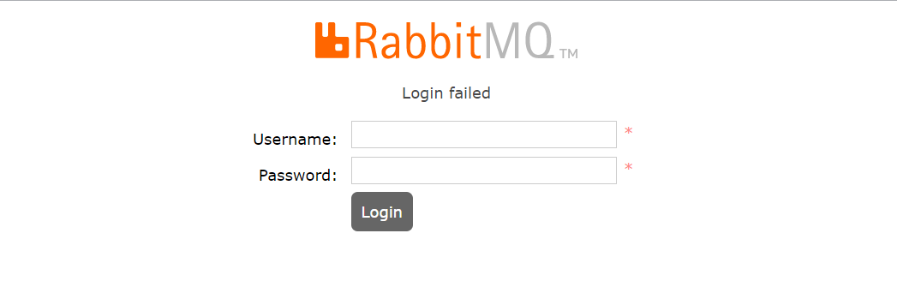

## 02、授权账号和密码

### 2-1：新增用户

```bash
rabbitmqctl add_user admin admin
```

### 2-2:设置用户分配操作权限

```bash
rabbitmqctl set_user_tags admin administrator
```

用户级别：

- 1、administrator 可以登录控制台、查看所有信息、可以对rabbitmq进行管理
- 2、monitoring 监控者 登录控制台，查看所有信息
- 3、policymaker 策略制定者 登录控制台,指定策略
- 4、managment 普通管理员 登录控制台

### 2-3：为用户添加资源权限

```bash
rabbitmqctl.bat set_permissions -p / admin ".*" ".*" ".*"
```

## 03、小结：

```bash
rabbitmqctl add_user 账号 密码
rabbitmqctl set_user_tags 账号 administrator
rabbitmqctl change_password Username Newpassword 修改密码
rabbitmqctl delete_user Username 删除用户
rabbitmqctl list_users 查看用户清单
rabbitmqctl set_permissions -p / 用户名 ".*" ".*" ".*" 为用户设置administrator角色
rabbitmqctl set_permissions -p / root ".*" ".*" ".*"
```

# RabbitMQ之Docker安装


## 01、Docker安装RabbitMQ

### 1-1、虚拟化容器技术—Docker的安装

```bash
（1）yum 包更新到最新
> yum update
（2）安装需要的软件包， yum-util 提供yum-config-manager功能，另外两个是devicemapper驱动依赖的
> yum install -y yum-utils device-mapper-persistent-data lvm2
（3）设置yum源为阿里云
> yum-config-manager --add-repo http://mirrors.aliyun.com/docker-ce/linux/centos/docker-ce.repo
（4）安装docker
> yum install docker-ce -y
（5）安装后查看docker版本
> docker -v
 (6) 安装加速镜像
 sudo mkdir -p /etc/docker
 sudo tee /etc/docker/daemon.json <<-'EOF'
 {
  "registry-mirrors": ["https://0wrdwnn6.mirror.aliyuncs.com"]
 }
 EOF
 sudo systemctl daemon-reload
 sudo systemctl restart docker
```

### 1-2、docker的相关命令

```bash
# 启动docker：
systemctl start docker
# 停止docker：
systemctl stop docker
# 重启docker：
systemctl restart docker
# 查看docker状态：
systemctl status docker
# 开机启动：  
systemctl enable docker
systemctl unenable docker
# 查看docker概要信息
docker info
# 查看docker帮助文档
docker --help
```

### 1-3、安装rabbitmq

参考网站：
1：https://www.rabbitmq.com/download.html
2：https://registry.hub.docker.com/_/rabbitmq/

### 1-4、获取rabbit镜像：

```bash
docker pull rabbitmq:management
```

### 1-5、创建并运行容器

```bash
docker run -di --name=myrabbit -p 15672:15672 rabbitmq:management
```

—hostname：指定容器主机名称
—name:指定容器名称
-p:将mq端口号映射到本地
或者运行时设置用户和密码

```bash
docker run -di --name myrabbit -e RABBITMQ_DEFAULT_USER=admin -e RABBITMQ_DEFAULT_PASS=admin -p 15672:15672 -p 5672:5672 -p 25672:25672 -p 61613:61613 -p 1883:1883 rabbitmq:management
```

查看日志

```bash
docker logs -f myrabbit
```

### 1-6、容器运行正常

使用 `http://你的IP地址:15672` 访问rabbit控制台

## 02、额外Linux相关排查命令

```bash
> more xxx.log  查看日记信息
> netstat -naop | grep 5672 查看端口是否被占用
> ps -ef | grep 5672  查看进程
> systemctl stop 服务
```

# RabbitMQ的角色分类


## 01、RabbitMQ的角色分类

### 1：none：

- 不能访问management plugin

### 2：management：查看自己相关节点信息

- 列出自己可以通过AMQP登入的虚拟机
- 查看自己的虚拟机节点 virtual hosts的queues,exchanges和bindings信息
- 查看和关闭自己的channels和connections
- 查看有关自己的虚拟机节点virtual hosts的统计信息。包括其他用户在这个节点virtual hosts中的活动信息。

### 3：Policymaker

- 包含management所有权限
- 查看和创建和删除自己的virtual hosts所属的policies和parameters信息。

### 4：Monitoring

- 包含management所有权限
- 罗列出所有的virtual hosts，包括不能登录的virtual hosts。
- 查看其他用户的connections和channels信息
- 查看节点级别的数据如clustering和memory使用情况
- 查看所有的virtual hosts的全局统计信息。

### 5：Administrator

- 最高权限
- 可以创建和删除virtual hosts
- 可以查看，创建和删除users
- 查看创建permisssions
- 关闭所有用户的connections

### 6、具体操作的界面


# RabbitMQ入门案例 - Simple 简单模式


## 01、实现步骤

1：jdk1.8
2：构建一个maven工程
3：导入rabbitmq的maven依赖
4：启动rabbitmq-server服务
5：定义生产者
6：定义消费者
7：观察消息的在rabbitmq-server服务中的过程

## 02、构建一个maven工程

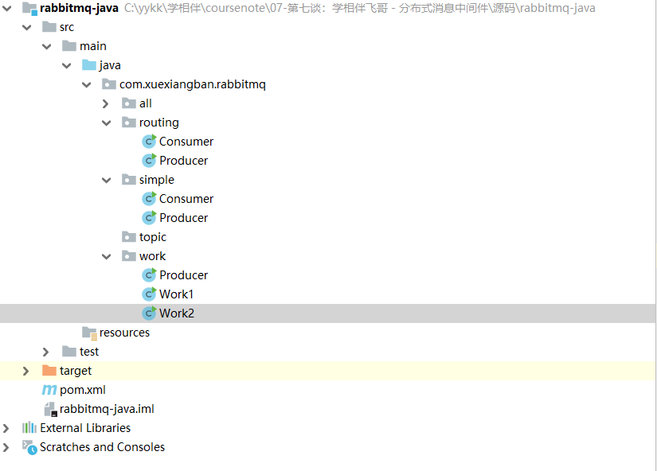

## 03、导入rabbitmq的maven依赖

### 03-1：Java原生依赖

```xml
<dependency>
    <groupId>com.rabbitmq</groupId>
    <artifactId>amqp-client</artifactId>
    <version>5.10.0</version>
</dependency>
```

### 03-2：spring依赖

```xml
<dependency>
    <groupId>org.springframework.amqp</groupId>
    <artifactId>spring-amqp</artifactId>
    <version>2.2.5.RELEASE</version>
</dependency>
<dependency>
    <groupId>org.springframework.amqp</groupId>
    <artifactId>spring-rabbit</artifactId>
    <version>2.2.5.RELEASE</version>
</dependency>
```

#### 03-3、springboot依赖

```xml
<dependency>
    <groupId>org.springframework.boot</groupId>
    <artifactId>spring-boot-starter-amqp</artifactId>
</dependency>
```

上面根据自己的项目环境进行选择即可。

> 番外：rabbitmq和spring同属一个公司开放的产品，所以他们的支持也是非常完善，这也是为什么推荐使用rabbitmq的一个原因。

## 04、启动rabbitmq-server服务

```bash
systemctl start rabbitmq-server
或者
docker start myrabbit
```

## 05、定义生产者

```java
package com.xuexiangban.rabbitmq.simple;
import com.rabbitmq.client.Channel;
import com.rabbitmq.client.Connection;
import com.rabbitmq.client.ConnectionFactory;
/**
 * @author: 学相伴-飞哥
 * @description: Producer 简单队列生产者
 * @Date : 2021/3/2
 */
public class Producer {
    public static void main(String[] args) {
        // 1: 创建连接工厂
        ConnectionFactory connectionFactory = new ConnectionFactory();
        // 2: 设置连接属性
        connectionFactory.setHost("47.104.141.27");
        connectionFactory.setPort(5672);
        connectionFactory.setVirtualHost("/");
        connectionFactory.setUsername("admin");
        connectionFactory.setPassword("admin");
        Connection connection = null;
        Channel channel = null;
        try {
            // 3: 从连接工厂中获取连接
            connection = connectionFactory.newConnection("生产者");
            // 4: 从连接中获取通道channel
            channel = connection.createChannel();
            // 5: 申明队列queue存储消息
            /*
             *  如果队列不存在，则会创建
             *  Rabbitmq不允许创建两个相同的队列名称，否则会报错。
             *
             *  @params1： queue 队列的名称
             *  @params2： durable 队列是否持久化
             *  @params3： exclusive 是否排他，即是否私有的，如果为true,会对当前队列加锁，其他的通道不能访问，并且连接自动关闭
             *  @params4： autoDelete 是否自动删除，当最后一个消费者断开连接之后是否自动删除消息。
             *  @params5： arguments 可以设置队列附加参数，设置队列的有效期，消息的最大长度，队列的消息生命周期等等。
             * */
            channel.queueDeclare("queue1", false, false, false, null);
            // 6： 准备发送消息的内容
            String message = "你好，学相伴！！！";
            // 7: 发送消息给中间件rabbitmq-server
            // @params1: 交换机exchange
            // @params2: 队列名称/routing
            // @params3: 属性配置
            // @params4: 发送消息的内容
            channel.basicPublish("", "queue1", null, message.getBytes());
            System.out.println("消息发送成功!");
        } catch (Exception ex) {
            ex.printStackTrace();
            System.out.println("发送消息出现异常...");
        } finally {
            // 7: 释放连接关闭通道
            if (channel != null && channel.isOpen()) {
                try {
                    channel.close();
                } catch (Exception ex) {
                    ex.printStackTrace();
                }
            }
            if (connection != null) {
                try {
                    connection.close();
                } catch (Exception ex) {
                    ex.printStackTrace();
                }
            }
        }
    }
}
```

1：执行发送，这个时候可以在web控制台查看到这个队列queue的信息


2：我们可以进行对队列的消息进行预览和测试如下：


3:进行预览和获取消息进行测试


## 06、定义消费者

```java
package com.xuexiangban.rabbitmq.simple;
import com.rabbitmq.client.Channel;
import com.rabbitmq.client.Connection;
import com.rabbitmq.client.ConnectionFactory;
/**
 * @author: 学相伴-飞哥
 * @description: Producer 简单队列生产者
 * @Date : 2021/3/2
 */
public class Producer {
    public static void main(String[] args) {
        // 1: 创建连接工厂
        ConnectionFactory connectionFactory = new ConnectionFactory();
        // 2: 设置连接属性
        connectionFactory.setHost("47.104.141.27");
        connectionFactory.setPort(5672);
        connectionFactory.setVirtualHost("/");
        connectionFactory.setUsername("admin");
        connectionFactory.setPassword("admin");
        Connection connection = null;
        Channel channel = null;
        try {
            // 3: 从连接工厂中获取连接
            connection = connectionFactory.newConnection("生产者");
            // 4: 从连接中获取通道channel
            channel = connection.createChannel();
            // 5: 申明队列queue存储消息
            /*
             *  如果队列不存在，则会创建
             *  Rabbitmq不允许创建两个相同的队列名称，否则会报错。
             *
             *  @params1： queue 队列的名称
             *  @params2： durable 队列是否持久化
             *  @params3： exclusive 是否排他，即是否私有的，如果为true,会对当前队列加锁，其他的通道不能访问，并且连接自动关闭
             *  @params4： autoDelete 是否自动删除，当最后一个消费者断开连接之后是否自动删除消息。
             *  @params5： arguments 可以设置队列附加参数，设置队列的有效期，消息的最大长度，队列的消息生命周期等等。
             * */
            channel.queueDeclare("queue1", false, false, false, null);
            // 6： 准备发送消息的内容
            String message = "你好，学相伴！！！";
            // 7: 发送消息给中间件rabbitmq-server
            // @params1: 交换机exchange
            // @params2: 队列名称/routing
            // @params3: 属性配置
            // @params4: 发送消息的内容
            channel.basicPublish("", "queue1", null, message.getBytes());
            System.out.println("消息发送成功!");
        } catch (Exception ex) {
            ex.printStackTrace();
            System.out.println("发送消息出现异常...");
        } finally {
            // 7: 释放连接关闭通道
            if (channel != null && channel.isOpen()) {
                try {
                    channel.close();
                } catch (Exception ex) {
                    ex.printStackTrace();
                }
            }
            if (connection != null) {
                try {
                    connection.close();
                } catch (Exception ex) {
                    ex.printStackTrace();
                }
            }
        }
    }
}
```

## 07、观察消息的在rabbitmq-server服务中的过程

- 具体详细视频教程

# 什么是AMQP


## 什么是AMQP

AMQP全称：Advanced Message Queuing Protocol(高级消息队列协议)。是应用层协议的一个开发标准，为面向消息的中间件设计。

## AMQP生产者流转过程

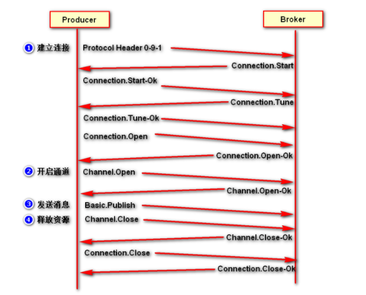

## AMQP消费者流转过程


# RabbitMQ的核心组成部分


## 01、RabbitMQ的核心组成部分


核心概念：
**Server**：又称Broker ,接受客户端的连接，实现AMQP实体服务。 安装rabbitmq-server
**Connection**：连接，应用程序与Broker的网络连接 TCP/IP/ 三次握手和四次挥手
**Channel**：网络信道，几乎所有的操作都在Channel中进行，Channel是进行消息读写的通道，客户端可以建立对各Channel，每个Channel代表一个会话任务。
**Message** :消息：服务与应用程序之间传送的数据，由Properties和body组成，Properties可是对消息进行修饰，比如消息的优先级，延迟等高级特性，Body则就是消息体的内容。
**Virtual Host** 虚拟地址，用于进行逻辑隔离，最上层的消息路由，一个虚拟主机理由可以有若干个Exhange和Queueu，同一个虚拟主机里面不能有相同名字的Exchange
**Exchange**：交换机，接受消息，根据路由键发送消息到绑定的队列。(==不具备消息存储的能力==)
**Bindings**：Exchange和Queue之间的虚拟连接，binding中可以保护多个routing key.
**Routing key**：是一个路由规则，虚拟机可以用它来确定如何路由一个特定消息。
**Queue**：队列：也成为Message Queue,消息队列，保存消息并将它们转发给消费者。

## 02、RabbitMQ整体架构是什么样子的？


## 03、RabbitMQ的运行流程


## 03、RabbitMQ支持消息的模式

参考官网：https://www.rabbitmq.com/getstarted.html

### 03-1、简单模式 Simple

- 参考第12章节

### 03-2、工作模式 Work

- web操作查看视频
- 类型：无
- 特点：分发机制

### 03-3、发布订阅模式

- web操作查看视频
- 类型：fanout
- 特点：Fanout—发布与订阅模式，是一种广播机制，它是没有路由key的模式。

### 03-4、路由模式

- web操作查看视频
- 类型：direct
- 特点：有routing-key的匹配模式

### 03-5、主题Topic模式

- web操作查看视频
- 类型：topic
- 特点：模糊的routing-key的匹配模式

### 03-6、参数模式

- web操作查看视频
- 类型：headers
- 特点：参数匹配模式

## 小结

- rabbitmq发送消息一定有一个交换机
- 如果队列没有指定交换机会默认绑定一个交换机
  

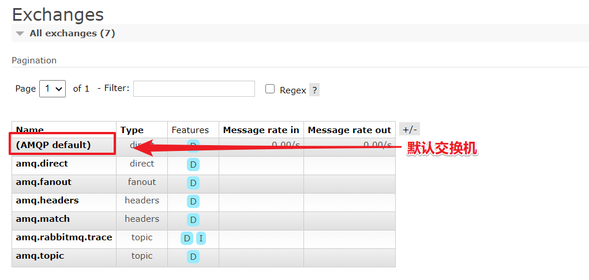

# RabbitMQ入门案例 - fanout模式

[ 飞哥 ](https://www.kuangstudy.com/user/aaa284f6f98146d4a927e0d42dacb01b) 分类：[学习笔记](https://www.kuangstudy.com/bbs?cid=4) 创建时间：2021/03/02 19:18 [字体](javascript:void(0);) [皮肤](javascript:void(0);)最后修改于： 2021/03/04 14:08

## RabbitMQ支持消息的模式

参考官网：https://www.rabbitmq.com/getstarted.html

## 01、RabbitMQ的模式之发布订阅模式

#### 图解


### 01-1、发布订阅模式具体实现

- web操作查看视频
- 类型：fanout
- 特点：Fanout—发布与订阅模式，是一种广播机制，它是没有路由key的模式。

#### 生产者

```java
package com.xuexiangban.rabbitmq.routing;
import com.rabbitmq.client.Channel;
import com.rabbitmq.client.Connection;
import com.rabbitmq.client.ConnectionFactory;
/**
 * @author: 学相伴-飞哥
 * @description: Producer 简单队列生产者
 * @Date : 2021/3/2
 */
public class Producer {
    public static void main(String[] args) {
        // 1: 创建连接工厂
        ConnectionFactory connectionFactory = new ConnectionFactory();
        // 2: 设置连接属性
        connectionFactory.setHost("47.104.141.27");
        connectionFactory.setPort(5672);
        connectionFactory.setVirtualHost("/");
        connectionFactory.setUsername("admin");
        connectionFactory.setPassword("admin");
        Connection connection = null;
        Channel channel = null;
        try {
            // 3: 从连接工厂中获取连接
            connection = connectionFactory.newConnection("生产者");
            // 4: 从连接中获取通道channel
            channel = connection.createChannel();
            // 6： 准备发送消息的内容
            String message = "你好，学相伴！！！";
            String  exchangeName = "fanout-exchange";
            String routingKey = "";
            // 7: 发送消息给中间件rabbitmq-server
            // @params1: 交换机exchange
            // @params2: 队列名称/routingkey
            // @params3: 属性配置
            // @params4: 发送消息的内容
            channel.basicPublish(exchangeName, routingKey, null, message.getBytes());
            System.out.println("消息发送成功!");
        } catch (Exception ex) {
            ex.printStackTrace();
            System.out.println("发送消息出现异常...");
        } finally {
            // 7: 释放连接关闭通道
            if (channel != null && channel.isOpen()) {
                try {
                    channel.close();
                } catch (Exception ex) {
                    ex.printStackTrace();
                }
            }
            if (connection != null) {
                try {
                    connection.close();
                } catch (Exception ex) {
                    ex.printStackTrace();
                }
            }
        }
    }
}
```

#### 消费者

```java
package com.xuexiangban.rabbitmq.routing;
import com.rabbitmq.client.*;
import java.io.IOException;
/**
 * @author: 学相伴-飞哥
 * @description: Consumer
 * @Date : 2021/3/2
 */
public class Consumer {
    private static Runnable runnable = () -> {
        // 1: 创建连接工厂
        ConnectionFactory connectionFactory = new ConnectionFactory();
        // 2: 设置连接属性
        connectionFactory.setHost("47.104.141.27");
        connectionFactory.setPort(5672);
        connectionFactory.setVirtualHost("/");
        connectionFactory.setUsername("admin");
        connectionFactory.setPassword("admin");
        //获取队列的名称
        final String queueName = Thread.currentThread().getName();
        Connection connection = null;
        Channel channel = null;
        try {
            // 3: 从连接工厂中获取连接
            connection = connectionFactory.newConnection("生产者");
            // 4: 从连接中获取通道channel
            channel = connection.createChannel();
            // 5: 申明队列queue存储消息
            /*
             *  如果队列不存在，则会创建
             *  Rabbitmq不允许创建两个相同的队列名称，否则会报错。
             *
             *  @params1： queue 队列的名称
             *  @params2： durable 队列是否持久化
             *  @params3： exclusive 是否排他，即是否私有的，如果为true,会对当前队列加锁，其他的通道不能访问，并且连接自动关闭
             *  @params4： autoDelete 是否自动删除，当最后一个消费者断开连接之后是否自动删除消息。
             *  @params5： arguments 可以设置队列附加参数，设置队列的有效期，消息的最大长度，队列的消息生命周期等等。
             * */
            // 这里如果queue已经被创建过一次了，可以不需要定义
            //channel.queueDeclare("queue1", false, false, false, null);
            // 6： 定义接受消息的回调
            Channel finalChannel = channel;
            finalChannel.basicConsume(queueName, true, new DeliverCallback() {
                @Override
                public void handle(String s, Delivery delivery) throws IOException {
                    System.out.println(queueName + "：收到消息是：" + new String(delivery.getBody(), "UTF-8"));
                }
            }, new CancelCallback() {
                @Override
                public void handle(String s) throws IOException {
                }
            });
            System.out.println(queueName + "：开始接受消息");
            System.in.read();
        } catch (Exception ex) {
            ex.printStackTrace();
            System.out.println("发送消息出现异常...");
        } finally {
            // 7: 释放连接关闭通道
            if (channel != null && channel.isOpen()) {
                try {
                    channel.close();
                } catch (Exception ex) {
                    ex.printStackTrace();
                }
            }
            if (connection != null && connection.isOpen()) {
                try {
                    connection.close();
                } catch (Exception ex) {
                    ex.printStackTrace();
                }
            }
        }
    };
    public static void main(String[] args) {
        // 启动三个线程去执行
        new Thread(runnable, "queue-1").start();
        new Thread(runnable, "queue-2").start();
        new Thread(runnable, "queue-3").start();
    }
}
```

# RabbitMQ入门案例 - Direct模式

[ 飞哥 ](https://www.kuangstudy.com/user/aaa284f6f98146d4a927e0d42dacb01b) 分类：[学习笔记](https://www.kuangstudy.com/bbs?cid=4) 创建时间：2021/03/02 19:19 [字体](javascript:void(0);) [皮肤](javascript:void(0);)最后修改于： 2021/03/04 14:08

## RabbitMQ支持消息的模式

参考官网：https://www.rabbitmq.com/getstarted.html

## 01、RabbitMQ的模式之Direct模式

#### 图解


### 01-1、发布订阅模式具体实现

- web操作查看视频
- 类型：direct
- 特点：Direct模式是fanout模式上的一种叠加，增加了路由RoutingKey的模式。

#### 生产者

```java
package com.xuexiangban.rabbitmq.routing;
import com.rabbitmq.client.Channel;
import com.rabbitmq.client.Connection;
import com.rabbitmq.client.ConnectionFactory;
/**
 * @author: 学相伴-飞哥
 * @description: Producer 简单队列生产者
 * @Date : 2021/3/2
 */
public class Producer {
    public static void main(String[] args) {
        // 1: 创建连接工厂
        ConnectionFactory connectionFactory = new ConnectionFactory();
        // 2: 设置连接属性
        connectionFactory.setHost("47.104.141.27");
        connectionFactory.setPort(5672);
        connectionFactory.setVirtualHost("/");
        connectionFactory.setUsername("admin");
        connectionFactory.setPassword("admin");
        Connection connection = null;
        Channel channel = null;
        try {
            // 3: 从连接工厂中获取连接
            connection = connectionFactory.newConnection("生产者");
            // 4: 从连接中获取通道channel
            channel = connection.createChannel();
            // 6： 准备发送消息的内容
            String message = "你好，学相伴！！！";
            String  exchangeName = "direct-exchange";
            String routingKey1 = "testkey";
            String routingKey2 = "testkey2";
            // 7: 发送消息给中间件rabbitmq-server
            // @params1: 交换机exchange
            // @params2: 队列名称/routingkey
            // @params3: 属性配置
            // @params4: 发送消息的内容
            channel.basicPublish(exchangeName, routingKey1, null, message.getBytes());
            channel.basicPublish(exchangeName, routingKey2, null, message.getBytes());
            System.out.println("消息发送成功!");
        } catch (Exception ex) {
            ex.printStackTrace();
            System.out.println("发送消息出现异常...");
        } finally {
            // 7: 释放连接关闭通道
            if (channel != null && channel.isOpen()) {
                try {
                    channel.close();
                } catch (Exception ex) {
                    ex.printStackTrace();
                }
            }
            if (connection != null) {
                try {
                    connection.close();
                } catch (Exception ex) {
                    ex.printStackTrace();
                }
            }
        }
    }
}
```

#### 消费者

```java
package com.xuexiangban.rabbitmq.routing;
import com.rabbitmq.client.*;
import java.io.IOException;
/**
 * @author: 学相伴-飞哥
 * @description: Consumer
 * @Date : 2021/3/2
 */
public class Consumer {
    private static Runnable runnable = () -> {
        // 1: 创建连接工厂
        ConnectionFactory connectionFactory = new ConnectionFactory();
        // 2: 设置连接属性
        connectionFactory.setHost("47.104.141.27");
        connectionFactory.setPort(5672);
        connectionFactory.setVirtualHost("/");
        connectionFactory.setUsername("admin");
        connectionFactory.setPassword("admin");
        //获取队列的名称
        final String queueName = Thread.currentThread().getName();
        Connection connection = null;
        Channel channel = null;
        try {
            // 3: 从连接工厂中获取连接
            connection = connectionFactory.newConnection("生产者");
            // 4: 从连接中获取通道channel
            channel = connection.createChannel();
            // 5: 申明队列queue存储消息
            /*
             *  如果队列不存在，则会创建
             *  Rabbitmq不允许创建两个相同的队列名称，否则会报错。
             *
             *  @params1： queue 队列的名称
             *  @params2： durable 队列是否持久化
             *  @params3： exclusive 是否排他，即是否私有的，如果为true,会对当前队列加锁，其他的通道不能访问，并且连接自动关闭
             *  @params4： autoDelete 是否自动删除，当最后一个消费者断开连接之后是否自动删除消息。
             *  @params5： arguments 可以设置队列附加参数，设置队列的有效期，消息的最大长度，队列的消息生命周期等等。
             * */
            // 这里如果queue已经被创建过一次了，可以不需要定义
            //channel.queueDeclare("queue1", false, false, false, null);
            // 6： 定义接受消息的回调
            Channel finalChannel = channel;
            finalChannel.basicConsume(queueName, true, new DeliverCallback() {
                @Override
                public void handle(String s, Delivery delivery) throws IOException {
                    System.out.println(queueName + "：收到消息是：" + new String(delivery.getBody(), "UTF-8"));
                }
            }, new CancelCallback() {
                @Override
                public void handle(String s) throws IOException {
                }
            });
            System.out.println(queueName + "：开始接受消息");
            System.in.read();
        } catch (Exception ex) {
            ex.printStackTrace();
            System.out.println("发送消息出现异常...");
        } finally {
            // 7: 释放连接关闭通道
            if (channel != null && channel.isOpen()) {
                try {
                    channel.close();
                } catch (Exception ex) {
                    ex.printStackTrace();
                }
            }
            if (connection != null && connection.isOpen()) {
                try {
                    connection.close();
                } catch (Exception ex) {
                    ex.printStackTrace();
                }
            }
        }
    };
    public static void main(String[] args) {
        // 启动三个线程去执行
        new Thread(runnable, "queue-1").start();
        new Thread(runnable, "queue-2").start();
        new Thread(runnable, "queue-3").start();
    }
}
```


# RabbitMQ入门案例 - Topic模式

[ 飞哥 ](https://www.kuangstudy.com/user/aaa284f6f98146d4a927e0d42dacb01b) 分类：[学习笔记](https://www.kuangstudy.com/bbs?cid=4) 创建时间：2021/03/02 19:19 [字体](javascript:void(0);) [皮肤](javascript:void(0);)最后修改于： 2021/03/04 14:08

## RabbitMQ支持消息的模式

参考官网：https://www.rabbitmq.com/getstarted.html

## 01、RabbitMQ的模式之Topic模式

#### 图解


### 01-1、发布订阅模式具体实现

- web操作查看视频
- 类型：topic
- 特点：Topic模式是direct模式上的一种叠加，增加了模糊路由RoutingKey的模式。

#### 生产者

```java
package com.xuexiangban.rabbitmq.routing;
import com.rabbitmq.client.Channel;
import com.rabbitmq.client.Connection;
import com.rabbitmq.client.ConnectionFactory;
/**
 * @author: 学相伴-飞哥
 * @description: Producer 简单队列生产者
 * @Date : 2021/3/2
 */
public class Producer {
    public static void main(String[] args) {
        // 1: 创建连接工厂
        ConnectionFactory connectionFactory = new ConnectionFactory();
        // 2: 设置连接属性
        connectionFactory.setHost("47.104.141.27");
        connectionFactory.setPort(5672);
        connectionFactory.setVirtualHost("/");
        connectionFactory.setUsername("admin");
        connectionFactory.setPassword("admin");
        Connection connection = null;
        Channel channel = null;
        try {
            // 3: 从连接工厂中获取连接
            connection = connectionFactory.newConnection("生产者");
            // 4: 从连接中获取通道channel
            channel = connection.createChannel();
            // 6： 准备发送消息的内容
            String message = "你好，学相伴！！！";
            String  exchangeName = "topic-exchange";
            String routingKey1 = "com.course.order";//都可以收到 queue-1 queue-2
            String routingKey2 = "com.order.user";//都可以收到 queue-1 queue-3
            // 7: 发送消息给中间件rabbitmq-server
            // @params1: 交换机exchange
            // @params2: 队列名称/routingkey
            // @params3: 属性配置
            // @params4: 发送消息的内容
            channel.basicPublish(exchangeName, routingKey1, null, message.getBytes());
            System.out.println("消息发送成功!");
        } catch (Exception ex) {
            ex.printStackTrace();
            System.out.println("发送消息出现异常...");
        } finally {
            // 7: 释放连接关闭通道
            if (channel != null && channel.isOpen()) {
                try {
                    channel.close();
                } catch (Exception ex) {
                    ex.printStackTrace();
                }
            }
            if (connection != null) {
                try {
                    connection.close();
                } catch (Exception ex) {
                    ex.printStackTrace();
                }
            }
        }
    }
}
```

#### 消费者

```java
package com.xuexiangban.rabbitmq.routing;
import com.rabbitmq.client.*;
import java.io.IOException;
/**
 * @author: 学相伴-飞哥
 * @description: Consumer
 * @Date : 2021/3/2
 */
public class Consumer {
    private static Runnable runnable = () -> {
        // 1: 创建连接工厂
        ConnectionFactory connectionFactory = new ConnectionFactory();
        // 2: 设置连接属性
        connectionFactory.setHost("47.104.141.27");
        connectionFactory.setPort(5672);
        connectionFactory.setVirtualHost("/");
        connectionFactory.setUsername("admin");
        connectionFactory.setPassword("admin");
        //获取队列的名称
        final String queueName = Thread.currentThread().getName();
        Connection connection = null;
        Channel channel = null;
        try {
            // 3: 从连接工厂中获取连接
            connection = connectionFactory.newConnection("生产者");
            // 4: 从连接中获取通道channel
            channel = connection.createChannel();
            // 5: 申明队列queue存储消息
            /*
             *  如果队列不存在，则会创建
             *  Rabbitmq不允许创建两个相同的队列名称，否则会报错。
             *
             *  @params1： queue 队列的名称
             *  @params2： durable 队列是否持久化
             *  @params3： exclusive 是否排他，即是否私有的，如果为true,会对当前队列加锁，其他的通道不能访问，并且连接自动关闭
             *  @params4： autoDelete 是否自动删除，当最后一个消费者断开连接之后是否自动删除消息。
             *  @params5： arguments 可以设置队列附加参数，设置队列的有效期，消息的最大长度，队列的消息生命周期等等。
             * */
            // 这里如果queue已经被创建过一次了，可以不需要定义
            //channel.queueDeclare("queue1", false, false, false, null);
            // 6： 定义接受消息的回调
            Channel finalChannel = channel;
            finalChannel.basicConsume(queueName, true, new DeliverCallback() {
                @Override
                public void handle(String s, Delivery delivery) throws IOException {
                    System.out.println(queueName + "：收到消息是：" + new String(delivery.getBody(), "UTF-8"));
                }
            }, new CancelCallback() {
                @Override
                public void handle(String s) throws IOException {
                }
            });
            System.out.println(queueName + "：开始接受消息");
            System.in.read();
        } catch (Exception ex) {
            ex.printStackTrace();
            System.out.println("发送消息出现异常...");
        } finally {
            // 7: 释放连接关闭通道
            if (channel != null && channel.isOpen()) {
                try {
                    channel.close();
                } catch (Exception ex) {
                    ex.printStackTrace();
                }
            }
            if (connection != null && connection.isOpen()) {
                try {
                    connection.close();
                } catch (Exception ex) {
                    ex.printStackTrace();
                }
            }
        }
    };
    public static void main(String[] args) {
        // 启动三个线程去执行
        new Thread(runnable, "queue-1").start();
        new Thread(runnable, "queue-2").start();
        new Thread(runnable, "queue-3").start();
    }
}
```

# RabbitMQ入门案例 - Work模式 - 轮询模式（Round-Robin）

[ 飞哥 ](https://www.kuangstudy.com/user/aaa284f6f98146d4a927e0d42dacb01b) 分类：[学习笔记](https://www.kuangstudy.com/bbs?cid=4) 创建时间：2021/03/02 19:19 [字体](javascript:void(0);) [皮肤](javascript:void(0);)最后修改于： 2021/03/03 15:59

## 01、RabbitMQ支持消息的模式

参考官网：https://www.rabbitmq.com/getstarted.html

## 02、Work模式轮询模式（Round-Robin）

### 图解


当有多个消费者时，我们的消息会被哪个消费者消费呢，我们又该如何均衡消费者消费信息的多少呢?
主要有两种模式：
1、轮询模式的分发：一个消费者一条，按均分配；
2、公平分发：根据消费者的消费能力进行公平分发，处理快的处理的多，处理慢的处理的少；按劳分配；

### Work模式 - 轮询模式（Round-Robin）

- 类型：无
- 特点：该模式接收消息是当有多个消费者接入时，消息的分配模式是一个消费者分配一条，直至消息消费完成；

#### 生产者

```java
package com.xuexiangban.rabbitmq.work.lunxun;
import com.rabbitmq.client.Channel;
import com.rabbitmq.client.Connection;
import com.rabbitmq.client.ConnectionFactory;
/**
 * @author: 学相伴-飞哥
 * @description: Producer 简单队列生产者
 * @Date : 2021/3/2
 */
public class Producer {
    public static void main(String[] args) {
        // 1: 创建连接工厂
        ConnectionFactory connectionFactory = new ConnectionFactory();
        // 2: 设置连接属性
        connectionFactory.setHost("47.104.141.27");
        connectionFactory.setPort(5672);
        connectionFactory.setVirtualHost("/");
        connectionFactory.setUsername("admin");
        connectionFactory.setPassword("admin");
        Connection connection = null;
        Channel channel = null;
        try {
            // 3: 从连接工厂中获取连接
            connection = connectionFactory.newConnection("生产者");
            // 4: 从连接中获取通道channel
            channel = connection.createChannel();
            // 6： 准备发送消息的内容
            //===============================end topic模式==================================
            for (int i = 1; i <= 20; i++) {
                //消息的内容
                String msg = "学相伴:" + i;
                // 7: 发送消息给中间件rabbitmq-server
                // @params1: 交换机exchange
                // @params2: 队列名称/routingkey
                // @params3: 属性配置
                // @params4: 发送消息的内容
                channel.basicPublish("", "queue1", null, msg.getBytes());
            }
            System.out.println("消息发送成功!");
        } catch (Exception ex) {
            ex.printStackTrace();
            System.out.println("发送消息出现异常...");
        } finally {
            // 7: 释放连接关闭通道
            if (channel != null && channel.isOpen()) {
                try {
                    channel.close();
                } catch (Exception ex) {
                    ex.printStackTrace();
                }
            }
            if (connection != null) {
                try {
                    connection.close();
                } catch (Exception ex) {
                    ex.printStackTrace();
                }
            }
        }
    }
}
```

### 消费者 - Work1

```java
package com.xuexiangban.rabbitmq.work.lunxun;
import com.rabbitmq.client.*;
import java.io.IOException;
/**
 * @author: 学相伴-飞哥
 * @description: Consumer
 * @Date : 2021/3/2
 */
public class Work1 {
    public static void main(String[] args) {
        // 1: 创建连接工厂
        ConnectionFactory connectionFactory = new ConnectionFactory();
        // 2: 设置连接属性
        connectionFactory.setHost("47.104.141.27");
        connectionFactory.setPort(5672);
        connectionFactory.setVirtualHost("/");
        connectionFactory.setUsername("admin");
        connectionFactory.setPassword("admin");
        Connection connection = null;
        Channel channel = null;
        try {
            // 3: 从连接工厂中获取连接
            connection = connectionFactory.newConnection("消费者-Work1");
            // 4: 从连接中获取通道channel
            channel = connection.createChannel();
            // 5: 申明队列queue存储消息
            /*
             *  如果队列不存在，则会创建
             *  Rabbitmq不允许创建两个相同的队列名称，否则会报错。
             *
             *  @params1： queue 队列的名称
             *  @params2： durable 队列是否持久化
             *  @params3： exclusive 是否排他，即是否私有的，如果为true,会对当前队列加锁，其他的通道不能访问，并且连接自动关闭
             *  @params4： autoDelete 是否自动删除，当最后一个消费者断开连接之后是否自动删除消息。
             *  @params5： arguments 可以设置队列附加参数，设置队列的有效期，消息的最大长度，队列的消息生命周期等等。
             * */
            // 这里如果queue已经被创建过一次了，可以不需要定义
//            channel.queueDeclare("queue1", false, false, false, null);
            // 同一时刻，服务器只会推送一条消息给消费者
            // 6： 定义接受消息的回调
            Channel finalChannel = channel;
            finalChannel.basicQos(1);
            finalChannel.basicConsume("queue1", true, new DeliverCallback() {
                @Override
                public void handle(String s, Delivery delivery) throws IOException {
                    try{
                        System.out.println("Work1-收到消息是：" + new String(delivery.getBody(), "UTF-8"));
                        Thread.sleep(2000);
                    }catch(Exception ex){
                        ex.printStackTrace();
                    }
                }
            }, new CancelCallback() {
                @Override
                public void handle(String s) throws IOException {
                }
            });
            System.out.println("Work1-开始接受消息");
            System.in.read();
        } catch (Exception ex) {
            ex.printStackTrace();
            System.out.println("发送消息出现异常...");
        } finally {
            // 7: 释放连接关闭通道
            if (channel != null && channel.isOpen()) {
                try {
                    channel.close();
                } catch (Exception ex) {
                    ex.printStackTrace();
                }
            }
            if (connection != null && connection.isOpen()) {
                try {
                    connection.close();
                } catch (Exception ex) {
                    ex.printStackTrace();
                }
            }
        }
    }
}
```

### 消费者 - Work2

```java
package com.xuexiangban.rabbitmq.work.lunxun;
import com.rabbitmq.client.*;
import java.io.IOException;
/**
 * @author: 学相伴-飞哥
 * @description: Consumer
 * @Date : 2021/3/2
 */
public class Work2 {
    public static void main(String[] args) {
        // 1: 创建连接工厂
        ConnectionFactory connectionFactory = new ConnectionFactory();
        // 2: 设置连接属性
        connectionFactory.setHost("47.104.141.27");
        connectionFactory.setPort(5672);
        connectionFactory.setVirtualHost("/");
        connectionFactory.setUsername("admin");
        connectionFactory.setPassword("admin");
        Connection connection = null;
        Channel channel = null;
        try {
            // 3: 从连接工厂中获取连接
            connection = connectionFactory.newConnection("消费者-Work2");
            // 4: 从连接中获取通道channel
            channel = connection.createChannel();
            // 5: 申明队列queue存储消息
            /*
             *  如果队列不存在，则会创建
             *  Rabbitmq不允许创建两个相同的队列名称，否则会报错。
             *
             *  @params1： queue 队列的名称
             *  @params2： durable 队列是否持久化
             *  @params3： exclusive 是否排他，即是否私有的，如果为true,会对当前队列加锁，其他的通道不能访问，并且连接自动关闭
             *  @params4： autoDelete 是否自动删除，当最后一个消费者断开连接之后是否自动删除消息。
             *  @params5： arguments 可以设置队列附加参数，设置队列的有效期，消息的最大长度，队列的消息生命周期等等。
             * */
            // 这里如果queue已经被创建过一次了，可以不需要定义
            //channel.queueDeclare("queue1", false, true, false, null);
            // 同一时刻，服务器只会推送一条消息给消费者
            //channel.basicQos(1);
            // 6： 定义接受消息的回调
            Channel finalChannel = channel;
            finalChannel.basicQos(1);
            finalChannel.basicConsume("queue1", true, new DeliverCallback() {
                @Override
                public void handle(String s, Delivery delivery) throws IOException {
                    try{
                        System.out.println("Work2-收到消息是：" + new String(delivery.getBody(), "UTF-8"));
                        Thread.sleep(200);
                    }catch(Exception ex){
                        ex.printStackTrace();
                    }
                }
            }, new CancelCallback() {
                @Override
                public void handle(String s) throws IOException {
                }
            });
            System.out.println("Work2-开始接受消息");
            System.in.read();
        } catch (Exception ex) {
            ex.printStackTrace();
            System.out.println("发送消息出现异常...");
        } finally {
            // 7: 释放连接关闭通道
            if (channel != null && channel.isOpen()) {
                try {
                    channel.close();
                } catch (Exception ex) {
                    ex.printStackTrace();
                }
            }
            if (connection != null && connection.isOpen()) {
                try {
                    connection.close();
                } catch (Exception ex) {
                    ex.printStackTrace();
                }
            }
        }
    }
}
```

## 03、小结

work1和work2的消息处理能力不同，但是最后处理的消息条数相同，是“按均分配”。

# RabbitMQ入门案例 - Work模式 - 公平分发（Fair Dispatch）

[ 飞哥 ](https://www.kuangstudy.com/user/aaa284f6f98146d4a927e0d42dacb01b) 分类：[学习笔记](https://www.kuangstudy.com/bbs?cid=4) 创建时间：2021/03/02 20:05 [字体](javascript:void(0);) [皮肤](javascript:void(0);)最后修改于： 2021/03/03 15:58

## 01、RabbitMQ支持消息的模式

参考官网：https://www.rabbitmq.com/getstarted.html

## 02、Work模式 - 公平分发（Fair Dispatch）

### 图解


当有多个消费者时，我们的消息会被哪个消费者消费呢，我们又该如何均衡消费者消费信息的多少呢?
主要有两种模式：
1、轮询模式的分发：一个消费者一条，按均分配；
2、公平分发：根据消费者的消费能力进行公平分发，处理快的处理的多，处理慢的处理的少；按劳分配；

## Work模式 - 公平分发（Fair Dispatch）

- 类型：无
- 特点：由于消息接收者处理消息的能力不同，存在处理快慢的问题，我们就需要能者多劳，处理快的多处理，处理慢的少处理；

### 生产者

```java
package com.xuexiangban.rabbitmq.work.fairr;
import com.rabbitmq.client.Channel;
import com.rabbitmq.client.Connection;
import com.rabbitmq.client.ConnectionFactory;
/**
 * @author: 学相伴-飞哥
 * @description: Producer 简单队列生产者
 * @Date : 2021/3/2
 */
public class Producer {
    public static void main(String[] args) {
        // 1: 创建连接工厂
        ConnectionFactory connectionFactory = new ConnectionFactory();
        // 2: 设置连接属性
        connectionFactory.setHost("47.104.141.27");
        connectionFactory.setPort(5672);
        connectionFactory.setVirtualHost("/");
        connectionFactory.setUsername("admin");
        connectionFactory.setPassword("admin");
        Connection connection = null;
        Channel channel = null;
        try {
            // 3: 从连接工厂中获取连接
            connection = connectionFactory.newConnection("生产者");
            // 4: 从连接中获取通道channel
            channel = connection.createChannel();
            // 6： 准备发送消息的内容
            //===============================end topic模式==================================
            for (int i = 1; i <= 20; i++) {
                //消息的内容
                String msg = "学相伴:" + i;
                // 7: 发送消息给中间件rabbitmq-server
                // @params1: 交换机exchange
                // @params2: 队列名称/routingkey
                // @params3: 属性配置
                // @params4: 发送消息的内容
                channel.basicPublish("", "queue1", null, msg.getBytes());
            }
            System.out.println("消息发送成功!");
        } catch (Exception ex) {
            ex.printStackTrace();
            System.out.println("发送消息出现异常...");
        } finally {
            // 7: 释放连接关闭通道
            if (channel != null && channel.isOpen()) {
                try {
                    channel.close();
                } catch (Exception ex) {
                    ex.printStackTrace();
                }
            }
            if (connection != null) {
                try {
                    connection.close();
                } catch (Exception ex) {
                    ex.printStackTrace();
                }
            }
        }
    }
}
```

### 消费者 - Work1

```java
package com.xuexiangban.rabbitmq.work.fairr;
import com.rabbitmq.client.*;
import java.io.IOException;
/**
 * @author: 学相伴-飞哥
 * @description: Consumer
 * @Date : 2021/3/2
 */
public class Work1 {
    public static void main(String[] args) {
        // 1: 创建连接工厂
        ConnectionFactory connectionFactory = new ConnectionFactory();
        // 2: 设置连接属性
        connectionFactory.setHost("47.104.141.27");
        connectionFactory.setPort(5672);
        connectionFactory.setVirtualHost("/");
        connectionFactory.setUsername("admin");
        connectionFactory.setPassword("admin");
        Connection connection = null;
        Channel channel = null;
        try {
            // 3: 从连接工厂中获取连接
            connection = connectionFactory.newConnection("消费者-Work1");
            // 4: 从连接中获取通道channel
            channel = connection.createChannel();
            // 5: 申明队列queue存储消息
            /*
             *  如果队列不存在，则会创建
             *  Rabbitmq不允许创建两个相同的队列名称，否则会报错。
             *
             *  @params1： queue 队列的名称
             *  @params2： durable 队列是否持久化
             *  @params3： exclusive 是否排他，即是否私有的，如果为true,会对当前队列加锁，其他的通道不能访问，并且连接自动关闭
             *  @params4： autoDelete 是否自动删除，当最后一个消费者断开连接之后是否自动删除消息。
             *  @params5： arguments 可以设置队列附加参数，设置队列的有效期，消息的最大长度，队列的消息生命周期等等。
             * */
            // 这里如果queue已经被创建过一次了，可以不需要定义
//            channel.queueDeclare("queue1", false, false, false, null);
            // 同一时刻，服务器只会推送一条消息给消费者
            // 6： 定义接受消息的回调
            Channel finalChannel = channel;
            finalChannel.basicQos(1);
            finalChannel.basicConsume("queue1", false, new DeliverCallback() {
                @Override
                public void handle(String s, Delivery delivery) throws IOException {
                    try{
                        System.out.println("Work1-收到消息是：" + new String(delivery.getBody(), "UTF-8"));
                        Thread.sleep(2000);
                        finalChannel.basicAck(delivery.getEnvelope().getDeliveryTag(),false);
                    }catch(Exception ex){
                        ex.printStackTrace();
                    }
                }
            }, new CancelCallback() {
                @Override
                public void handle(String s) throws IOException {
                }
            });
            System.out.println("Work1-开始接受消息");
            System.in.read();
        } catch (Exception ex) {
            ex.printStackTrace();
            System.out.println("发送消息出现异常...");
        } finally {
            // 7: 释放连接关闭通道
            if (channel != null && channel.isOpen()) {
                try {
                    channel.close();
                } catch (Exception ex) {
                    ex.printStackTrace();
                }
            }
            if (connection != null && connection.isOpen()) {
                try {
                    connection.close();
                } catch (Exception ex) {
                    ex.printStackTrace();
                }
            }
        }
    }
}
```

### 消费者 - Work2

```java
package com.xuexiangban.rabbitmq.work.fairr;
import com.rabbitmq.client.*;
import java.io.IOException;
/**
 * @author: 学相伴-飞哥
 * @description: Consumer
 * @Date : 2021/3/2
 */
public class Work2 {
    public static void main(String[] args) {
        // 1: 创建连接工厂
        ConnectionFactory connectionFactory = new ConnectionFactory();
        // 2: 设置连接属性
        connectionFactory.setHost("47.104.141.27");
        connectionFactory.setPort(5672);
        connectionFactory.setVirtualHost("/");
        connectionFactory.setUsername("admin");
        connectionFactory.setPassword("admin");
        Connection connection = null;
        Channel channel = null;
        try {
            // 3: 从连接工厂中获取连接
            connection = connectionFactory.newConnection("消费者-Work2");
            // 4: 从连接中获取通道channel
            channel = connection.createChannel();
            // 5: 申明队列queue存储消息
            /*
             *  如果队列不存在，则会创建
             *  Rabbitmq不允许创建两个相同的队列名称，否则会报错。
             *
             *  @params1： queue 队列的名称
             *  @params2： durable 队列是否持久化
             *  @params3： exclusive 是否排他，即是否私有的，如果为true,会对当前队列加锁，其他的通道不能访问，并且连接自动关闭
             *  @params4： autoDelete 是否自动删除，当最后一个消费者断开连接之后是否自动删除消息。
             *  @params5： arguments 可以设置队列附加参数，设置队列的有效期，消息的最大长度，队列的消息生命周期等等。
             * */
            // 这里如果queue已经被创建过一次了，可以不需要定义
            //channel.queueDeclare("queue1", false, true, false, null);
            // 同一时刻，服务器只会推送一条消息给消费者
            //channel.basicQos(1);
            // 6： 定义接受消息的回调
            Channel finalChannel = channel;
            finalChannel.basicQos(1);
            finalChannel.basicConsume("queue1", false, new DeliverCallback() {
                @Override
                public void handle(String s, Delivery delivery) throws IOException {
                    try{
                        System.out.println("Work2-收到消息是：" + new String(delivery.getBody(), "UTF-8"));
                        Thread.sleep(200);
                        finalChannel.basicAck(delivery.getEnvelope().getDeliveryTag(),false);
                    }catch(Exception ex){
                        ex.printStackTrace();
                    }
                }
            }, new CancelCallback() {
                @Override
                public void handle(String s) throws IOException {
                }
            });
            System.out.println("Work2-开始接受消息");
            System.in.read();
        } catch (Exception ex) {
            ex.printStackTrace();
            System.out.println("发送消息出现异常...");
        } finally {
            // 7: 释放连接关闭通道
            if (channel != null && channel.isOpen()) {
                try {
                    channel.close();
                } catch (Exception ex) {
                    ex.printStackTrace();
                }
            }
            if (connection != null && connection.isOpen()) {
                try {
                    connection.close();
                } catch (Exception ex) {
                    ex.printStackTrace();
                }
            }
        }
    }
}
```

## 03、小结

从结果可以看到，消费者1在相同时间内，处理了更多的消息；以上代码我们实现了公平分发模式；

- 消费者一次接收一条消息，代码channel.BasicQos(0, 1, false);
- 公平分发需要消费者开启手动应答，关闭自动应答
- 关闭自动应答代码channel.BasicConsume(“queue_test”, false, consumer);
- 消费者开启手动应答代码：channel.BasicAck(ea.DeliveryTag, false);

## 04、总结

（1）当队列里消息较多时，我们通常会开启多个消费者处理消息；公平分发和轮询分发都是我们经常使用的模式。
（2）轮询分发的主要思想是“按均分配”，不考虑消费者的处理能力，所有消费者均分；这种情况下，处理能力弱的服务器，一直都在处理消息，而处理能力强的服务器，在处理完消息后，处于空闲状态；
(3) 公平分发的主要思想是”能者多劳”，按需分配，能力强的干的多。

# RabbitMQ使用场景

[ 飞哥 ](https://www.kuangstudy.com/user/aaa284f6f98146d4a927e0d42dacb01b) 分类：[学习笔记](https://www.kuangstudy.com/bbs?cid=4) 创建时间：2021/03/04 14:05 [字体](javascript:void(0);) [皮肤](javascript:void(0);)最后修改于： 2021/03/04 21:47

## 01、解耦、削峰、异步

### 01-1、同步异步的问题（串行）

串行方式：将订单信息写入数据库成功后，发送注册邮件，再发送注册短信。以上三个任务全部完成后，返回给客户端


**代码**

```java
public void makeOrder(){
    // 1 :保存订单 
    orderService.saveOrder();
    // 2： 发送短信服务
    messageService.sendSMS("order");//1-2 s
    // 3： 发送email服务
    emailService.sendEmail("order");//1-2 s
    // 4： 发送APP服务
    appService.sendApp("order");    
}
```

### 01-2、并行方式 异步线程池

并行方式：将订单信息写入数据库成功后，发送注册邮件的同时，发送注册短信。以上三个任务完成后，返回给客户端。与串行的差别是，并行的方式可以提高处理的时间


**代码**

```java
public void makeOrder(){
    // 1 :保存订单 
    orderService.saveOrder();
   // 相关发送
   relationMessage();
}
public void relationMessage(){
    // 异步
     theadpool.submit(new Callable<Object>{
         public Object call(){
             // 2： 发送短信服务  
             messageService.sendSMS("order");
         }
     })
    // 异步
     theadpool.submit(new Callable<Object>{
         public Object call(){
              // 3： 发送email服务
            emailService.sendEmail("order");
         }
     })
      // 异步
     theadpool.submit(new Callable<Object>{
         public Object call(){
             // 4： 发送短信服务
             appService.sendApp("order");
         }
     })
      // 异步
         theadpool.submit(new Callable<Object>{
         public Object call(){
             // 4： 发送短信服务
             appService.sendApp("order");
         }
     })
}
```

存在问题：
1：耦合度高
2：需要自己写线程池自己维护成本太高
3：出现了消息可能会丢失，需要你自己做消息补偿
4：如何保证消息的可靠性你自己写
5：如果服务器承载不了，你需要自己去写高可用

### 01-2、异步消息队列的方式


**好处**
1：完全解耦，用MQ建立桥接
2：有独立的线程池和运行模型
3：出现了消息可能会丢失，MQ有持久化功能
4：如何保证消息的可靠性，死信队列和消息转移的等
5：如果服务器承载不了，你需要自己去写高可用，HA镜像模型高可用。
按照以上约定，用户的响应时间相当于是订单信息写入数据库的时间，也就是50毫秒。注册邮件，发送短信写入消息队列后，直接返回，因此写入消息队列的速度很快，基本可以忽略，因此用户的响应时间可能是50毫秒。因此架构改变后，系统的吞吐量提高到每秒20 QPS。比串行提高了3倍，比并行提高了两倍

**代码**

```
public void makeOrder(){    // 1 :保存订单     orderService.saveOrder();       rabbitTemplate.convertSend("ex","2","消息内容");}
```

## 02、高内聚，低耦合


03、流量的削峰


04、分布式事务的可靠消费和可靠生产
05、索引、缓存、静态化处理的数据同步
06、流量监控
07、日志监控（ELK）
08、下单、订单分发、抢票

# RabbitMQ-SpringBoot案例 -fanout模式

[ 飞哥 ](https://www.kuangstudy.com/user/aaa284f6f98146d4a927e0d42dacb01b) 分类：[学习笔记](https://www.kuangstudy.com/bbs?cid=4) 创建时间：2021/03/02 20:06 [字体](javascript:void(0);) [皮肤](javascript:void(0);)最后修改于： 2021/03/04 16:57

## 整体核心


## 01、目标

使用springboot完成rabbitmq的消费模式-Fanout

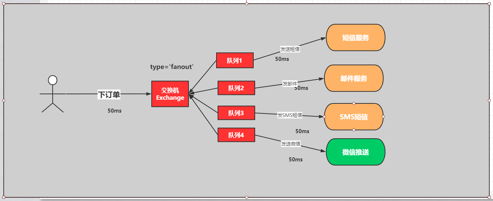

## 02、实现步骤

1：创建生产者工程：sspringboot-rabbitmq-fanout-producer
2：创建消费者工程：springboot-rabbitmq-fanout-consumer
3：引入spring-boot-rabbitmq的依赖
4：进行消息的分发和测试
5：查看和观察web控制台的状况

## 具体实现

## 03、生产者

### 1、创建生产者工程：sspringboot-rabbitmq-fanout-producer


### 2、在pom.xml中引入依赖

```xml
<dependency>
    <groupId>org.springframework.boot</groupId>
    <artifactId>spring-boot-starter-amqp</artifactId>
</dependency>
<dependency>
    <groupId>org.springframework.boot</groupId>
    <artifactId>spring-boot-starter-web</artifactId>
</dependency>
```

### 3、在application.yml进行配置

```yml
# 服务端口
server:
  port: 8080
# 配置rabbitmq服务
spring:
  rabbitmq:
    username: admin
    password: admin
    virtual-host: /
    host: 47.104.141.27
    port: 5672
```

### 4：定义订单的生产者

```java
package com.xuexiangban.rabbitmq.springbootrabbitmqfanoutproducer.service;
import org.springframework.amqp.rabbit.core.RabbitTemplate;
import org.springframework.beans.factory.annotation.Autowired;
import org.springframework.stereotype.Component;
import java.util.UUID;
/**
 * @author: 学相伴-飞哥
 * @description: OrderService
 * @Date : 2021/3/4
 */
@Component
public class OrderService {
    @Autowired
    private RabbitTemplate rabbitTemplate;
    // 1: 定义交换机
    private String exchangeName = "fanout_order_exchange";
    // 2: 路由key
    private String routeKey = "";
    public void makeOrder(Long userId, Long productId, int num) {
        // 1： 模拟用户下单
        String orderNumer = UUID.randomUUID().toString();
        // 2: 根据商品id productId 去查询商品的库存
        // int numstore = productSerivce.getProductNum(productId);
        // 3:判断库存是否充足
        // if(num >  numstore ){ return  "商品库存不足..."; }
        // 4: 下单逻辑
        // orderService.saveOrder(order);
        // 5: 下单成功要扣减库存
        // 6: 下单完成以后
        System.out.println("用户 " + userId + ",订单编号是：" + orderNumer);
        // 发送订单信息给RabbitMQ fanout
        rabbitTemplate.convertAndSend(exchangeName, routeKey, orderNumer);
    }
}
```

### 4、绑定关系

```java
package com.xuexiangban.rabbitmq.springbootrabbitmqfanoutproducer.service;
import org.springframework.amqp.core.Binding;
import org.springframework.amqp.core.BindingBuilder;
import org.springframework.amqp.core.DirectExchange;
import org.springframework.amqp.core.Queue;
import org.springframework.context.annotation.Bean;
import org.springframework.context.annotation.Configuration;
/**
 * @Author : JCccc
 * @CreateTime : 2019/9/3
 * @Description :
 **/
@Configuration
public class DirectRabbitConfig {
    //队列 起名：TestDirectQueue
    @Bean
    public Queue emailQueue() {
        // durable:是否持久化,默认是false,持久化队列：会被存储在磁盘上，当消息代理重启时仍然存在，暂存队列：当前连接有效
        // exclusive:默认也是false，只能被当前创建的连接使用，而且当连接关闭后队列即被删除。此参考优先级高于durable
        // autoDelete:是否自动删除，当没有生产者或者消费者使用此队列，该队列会自动删除。
        //   return new Queue("TestDirectQueue",true,true,false);
        //一般设置一下队列的持久化就好,其余两个就是默认false
        return new Queue("email.fanout.queue", true);
    }
    @Bean
    public Queue smsQueue() {
        // durable:是否持久化,默认是false,持久化队列：会被存储在磁盘上，当消息代理重启时仍然存在，暂存队列：当前连接有效
        // exclusive:默认也是false，只能被当前创建的连接使用，而且当连接关闭后队列即被删除。此参考优先级高于durable
        // autoDelete:是否自动删除，当没有生产者或者消费者使用此队列，该队列会自动删除。
        //   return new Queue("TestDirectQueue",true,true,false);
        //一般设置一下队列的持久化就好,其余两个就是默认false
        return new Queue("sms.fanout.queue", true);
    }
    @Bean
    public Queue weixinQueue() {
        // durable:是否持久化,默认是false,持久化队列：会被存储在磁盘上，当消息代理重启时仍然存在，暂存队列：当前连接有效
        // exclusive:默认也是false，只能被当前创建的连接使用，而且当连接关闭后队列即被删除。此参考优先级高于durable
        // autoDelete:是否自动删除，当没有生产者或者消费者使用此队列，该队列会自动删除。
        //   return new Queue("TestDirectQueue",true,true,false);
        //一般设置一下队列的持久化就好,其余两个就是默认false
        return new Queue("weixin.fanout.queue", true);
    }
    //Direct交换机 起名：TestDirectExchange
    @Bean
    public DirectExchange fanoutOrderExchange() {
        //  return new DirectExchange("TestDirectExchange",true,true);
        return new DirectExchange("fanout_order_exchange", true, false);
    }
    //绑定  将队列和交换机绑定, 并设置用于匹配键：TestDirectRouting
    @Bean
    public Binding bindingDirect1() {
        return BindingBuilder.bind(weixinQueue()).to(fanoutOrderExchange()).with("");
    }
    @Bean
    public Binding bindingDirect2() {
        return BindingBuilder.bind(smsQueue()).to(fanoutOrderExchange()).with("");
    }
    @Bean
    public Binding bindingDirect3() {
        return BindingBuilder.bind(emailQueue()).to(fanoutOrderExchange()).with("");
    }
}
```

### 5、进行测试

```java
package com.xuexiangban.rabbitmq.springbootrabbitmqfanoutproducer;
import com.xuexiangban.rabbitmq.springbootrabbitmqfanoutproducer.service.OrderService;
import org.junit.jupiter.api.Test;
import org.springframework.beans.factory.annotation.Autowired;
import org.springframework.boot.test.context.SpringBootTest;
@SpringBootTest
class SpringbootRabbitmqFanoutProducerApplicationTests {
    @Autowired
    OrderService orderService;
    @Test
    public void contextLoads() throws Exception {
        for (int i = 0; i < 10; i++) {
            Thread.sleep(1000);
            Long userId = 100L + i;
            Long productId = 10001L + i;
            int num = 10;
            orderService.makeOrder(userId, productId, num);
        }
    }
}
```

## 04、定义消费者

### 1、创建消费者工程：springboot-rabbitmq-fanout-consumer


### 2、引入依赖pom.xml

```xml
<dependency>
    <groupId>org.springframework.boot</groupId>
    <artifactId>spring-boot-starter-amqp</artifactId>
</dependency>
<dependency>
    <groupId>org.springframework.boot</groupId>
    <artifactId>spring-boot-starter-web</artifactId>
</dependency>
```

### 3、在application.yml进行配置

```yaml
# 服务端口
server:
  port: 8081
# 配置rabbitmq服务
spring:
  rabbitmq:
    username: admin
    password: admin
    virtual-host: /
    host: 47.104.141.27
    port: 5672
```

### 4、消费者 - 邮件服务

```java
package com.xuexiangban.rabbitmq.springbootrabbitmqfanoutconsumer.consumer;
import org.springframework.amqp.core.ExchangeTypes;
import org.springframework.amqp.rabbit.annotation.*;
import org.springframework.stereotype.Component;
// bindings其实就是用来确定队列和交换机绑定关系
@RabbitListener(bindings =@QueueBinding(
        // email.fanout.queue 是队列名字，这个名字你可以自定随便定义。
        value = @Queue(value = "email.fanout.queue",autoDelete = "false"),
        // order.fanout 交换机的名字 必须和生产者保持一致
        exchange = @Exchange(value = "fanout_order_exchange",
                // 这里是确定的rabbitmq模式是：fanout 是以广播模式 、 发布订阅模式
                type = ExchangeTypes.FANOUT)
))
@Component
public class EmailService {
    // @RabbitHandler 代表此方法是一个消息接收的方法。该不要有返回值
    @RabbitHandler
    public void messagerevice(String message){
        // 此处省略发邮件的逻辑
        System.out.println("email-------------->" + message);
    }
}
```

### 5、消费者 - 短信服务

```java
package com.xuexiangban.rabbitmq.springbootrabbitmqfanoutconsumer.consumer;
import org.springframework.amqp.core.ExchangeTypes;
import org.springframework.amqp.rabbit.annotation.*;
import org.springframework.stereotype.Component;
// bindings其实就是用来确定队列和交换机绑定关系
@RabbitListener(bindings =@QueueBinding(
        // email.fanout.queue 是队列名字，这个名字你可以自定随便定义。
        value = @Queue(value = "sms.fanout.queue",autoDelete = "false"),
        // order.fanout 交换机的名字 必须和生产者保持一致
        exchange = @Exchange(value = "fanout_order_exchange",
                // 这里是确定的rabbitmq模式是：fanout 是以广播模式 、 发布订阅模式
                type = ExchangeTypes.FANOUT)
))
@Component
public class SMSService {
    // @RabbitHandler 代表此方法是一个消息接收的方法。该不要有返回值
    @RabbitHandler
    public void messagerevice(String message){
        // 此处省略发邮件的逻辑
        System.out.println("sms-------------->" + message);
    }
}
```

### 6、消费者 - 微信服务

```java
package com.xuexiangban.rabbitmq.springbootrabbitmqfanoutconsumer.consumer;
import org.springframework.amqp.core.ExchangeTypes;
import org.springframework.amqp.rabbit.annotation.*;
import org.springframework.stereotype.Component;
// bindings其实就是用来确定队列和交换机绑定关系
@RabbitListener(bindings =@QueueBinding(
        // email.fanout.queue 是队列名字，这个名字你可以自定随便定义。
        value = @Queue(value = "weixin.fanout.queue",autoDelete = "false"),
        // order.fanout 交换机的名字 必须和生产者保持一致
        exchange = @Exchange(value = "fanout_order_exchange",
                // 这里是确定的rabbitmq模式是：fanout 是以广播模式 、 发布订阅模式
                type = ExchangeTypes.FANOUT)
))
@Component
public class WeixinService {
    // @RabbitHandler 代表此方法是一个消息接收的方法。该不要有返回值
    @RabbitHandler
    public void messagerevice(String message){
        // 此处省略发邮件的逻辑
        System.out.println("weixin-------------->" + message);
    }
}
```

### 7、启动服务SpringbootRabbitmqFanoutConsumerApplication，查看效果


# RabbitMQ-SpringBoot案例 -direct模式

[ 飞哥 ](https://www.kuangstudy.com/user/aaa284f6f98146d4a927e0d42dacb01b) 分类：[学习笔记](https://www.kuangstudy.com/bbs?cid=4) 创建时间：2021/03/02 20:07 [字体](javascript:void(0);) [皮肤](javascript:void(0);)最后修改于： 2021/03/04 17:06

## 整体核心


## 01、目标

使用springboot完成rabbitmq的消费模式-Fanout


## 02、实现步骤

1：创建生产者工程：sspringboot-rabbitmq-direct-producer
2：创建消费者工程：springboot-rabbitmq-direct-consumer
3：引入spring-boot-rabbitmq的依赖
4：进行消息的分发和测试
5：查看和观察web控制台的状况

## 具体实现

## 03、生产者

### 1、创建生产者工程：sspringboot-rabbitmq-direct-producer


### 2、在pom.xml中引入依赖

```xml
<dependency>
    <groupId>org.springframework.boot</groupId>
    <artifactId>spring-boot-starter-amqp</artifactId>
</dependency>
<dependency>
    <groupId>org.springframework.boot</groupId>
    <artifactId>spring-boot-starter-web</artifactId>
</dependency>
```

### 3、在application.yml进行配置

```yaml
# 服务端口
server:
  port: 8080
# 配置rabbitmq服务
spring:
  rabbitmq:
    username: admin
    password: admin
    virtual-host: /
    host: 47.104.141.27
    port: 5672
```

### 4：定义订单的生产者

```java
package com.xuexiangban.rabbitmq.springbootrabbitmqfanoutproducer.service;
import org.springframework.amqp.rabbit.core.RabbitTemplate;
import org.springframework.beans.factory.annotation.Autowired;
import org.springframework.stereotype.Component;
import java.util.UUID;
/**
 * @author: 学相伴-飞哥
 * @description: OrderService
 * @Date : 2021/3/4
 */
@Component
public class OrderService {
    @Autowired
    private RabbitTemplate rabbitTemplate;
    // 1: 定义交换机
    private String exchangeName = "direct_order_exchange";
    // 2: 路由key
    private String routeKey = "";
    public void makeOrder(Long userId, Long productId, int num) {
        // 1： 模拟用户下单
        String orderNumer = UUID.randomUUID().toString();
        // 2: 根据商品id productId 去查询商品的库存
        // int numstore = productSerivce.getProductNum(productId);
        // 3:判断库存是否充足
        // if(num >  numstore ){ return  "商品库存不足..."; }
        // 4: 下单逻辑
        // orderService.saveOrder(order);
        // 5: 下单成功要扣减库存
        // 6: 下单完成以后
        System.out.println("用户 " + userId + ",订单编号是：" + orderNumer);
        // 发送订单信息给RabbitMQ fanout
        rabbitTemplate.convertAndSend(exchangeName, routeKey, orderNumer);
    }
}
```

### 4、绑定关系

```java
package com.xuexiangban.rabbitmq.springbootrabbitmqfanoutproducer.service;
import org.springframework.amqp.core.Binding;
import org.springframework.amqp.core.BindingBuilder;
import org.springframework.amqp.core.DirectExchange;
import org.springframework.amqp.core.Queue;
import org.springframework.context.annotation.Bean;
import org.springframework.context.annotation.Configuration;
/**
 * @Author : JCccc
 * @CreateTime : 2019/9/3
 * @Description :
 **/
@Configuration
public class DirectRabbitConfig {
    //队列 起名：TestDirectQueue
    @Bean
    public Queue emailQueue() {
        // durable:是否持久化,默认是false,持久化队列：会被存储在磁盘上，当消息代理重启时仍然存在，暂存队列：当前连接有效
        // exclusive:默认也是false，只能被当前创建的连接使用，而且当连接关闭后队列即被删除。此参考优先级高于durable
        // autoDelete:是否自动删除，当没有生产者或者消费者使用此队列，该队列会自动删除。
        //   return new Queue("TestDirectQueue",true,true,false);
        //一般设置一下队列的持久化就好,其余两个就是默认false
        return new Queue("email.fanout.queue", true);
    }
    @Bean
    public Queue smsQueue() {
        // durable:是否持久化,默认是false,持久化队列：会被存储在磁盘上，当消息代理重启时仍然存在，暂存队列：当前连接有效
        // exclusive:默认也是false，只能被当前创建的连接使用，而且当连接关闭后队列即被删除。此参考优先级高于durable
        // autoDelete:是否自动删除，当没有生产者或者消费者使用此队列，该队列会自动删除。
        //   return new Queue("TestDirectQueue",true,true,false);
        //一般设置一下队列的持久化就好,其余两个就是默认false
        return new Queue("sms.fanout.queue", true);
    }
    @Bean
    public Queue weixinQueue() {
        // durable:是否持久化,默认是false,持久化队列：会被存储在磁盘上，当消息代理重启时仍然存在，暂存队列：当前连接有效
        // exclusive:默认也是false，只能被当前创建的连接使用，而且当连接关闭后队列即被删除。此参考优先级高于durable
        // autoDelete:是否自动删除，当没有生产者或者消费者使用此队列，该队列会自动删除。
        //   return new Queue("TestDirectQueue",true,true,false);
        //一般设置一下队列的持久化就好,其余两个就是默认false
        return new Queue("weixin.fanout.queue", true);
    }
    //Direct交换机 起名：TestDirectExchange
    @Bean
    public DirectExchange directOrderExchange() {
        //  return new DirectExchange("TestDirectExchange",true,true);
        return new DirectExchange("direct_order_exchange", true, false);
    }
    //绑定  将队列和交换机绑定, 并设置用于匹配键：TestDirectRouting
    @Bean
    public Binding bindingDirect1() {
        return BindingBuilder.bind(weixinQueue()).to(directOrderExchange()).with("");
    }
    @Bean
    public Binding bindingDirect2() {
        return BindingBuilder.bind(smsQueue()).to(directOrderExchange()).with("");
    }
    @Bean
    public Binding bindingDirect3() {
        return BindingBuilder.bind(emailQueue()).to(directOrderExchange()).with("");
    }
}
```

### 5、进行测试

```java
package com.xuexiangban.rabbitmq.springbootrabbitmqfanoutproducer;
import com.xuexiangban.rabbitmq.springbootrabbitmqfanoutproducer.service.OrderService;
import org.junit.jupiter.api.Test;
import org.springframework.beans.factory.annotation.Autowired;
import org.springframework.boot.test.context.SpringBootTest;
@SpringBootTest
class SpringbootRabbitmqFanoutProducerApplicationTests {
    @Autowired
    OrderService orderService;
    @Test
    public void contextLoads() throws Exception {
        for (int i = 0; i < 10; i++) {
            Thread.sleep(1000);
            Long userId = 100L + i;
            Long productId = 10001L + i;
            int num = 10;
            orderService.makeOrder(userId, productId, num);
        }
    }
}
```

## 04、定义消费者

### 1、创建消费者工程：springboot-rabbitmq-fanout-consumer


### 2、引入依赖pom.xml

```xml
<dependency>
    <groupId>org.springframework.boot</groupId>
    <artifactId>spring-boot-starter-amqp</artifactId>
</dependency>
<dependency>
    <groupId>org.springframework.boot</groupId>
    <artifactId>spring-boot-starter-web</artifactId>
</dependency>
```

### 3、在application.yml进行配置

```yaml
# 服务端口
server:
  port: 8081
# 配置rabbitmq服务
spring:
  rabbitmq:
    username: admin
    password: admin
    virtual-host: /
    host: 47.104.141.27
    port: 5672
```

### 4、消费者 - 邮件服务

```java
package com.xuexiangban.rabbitmq.springbootrabbitmqfanoutconsumer.consumer;
import org.springframework.amqp.core.ExchangeTypes;
import org.springframework.amqp.rabbit.annotation.*;
import org.springframework.stereotype.Component;
// bindings其实就是用来确定队列和交换机绑定关系
@RabbitListener(bindings =@QueueBinding(
        // email.fanout.queue 是队列名字，这个名字你可以自定随便定义。
        value = @Queue(value = "email.fanout.queue",autoDelete = "false"),
        // order.fanout 交换机的名字 必须和生产者保持一致
        exchange = @Exchange(value = "fanout_order_exchange",
                // 这里是确定的rabbitmq模式是：fanout 是以广播模式 、 发布订阅模式
                type = ExchangeTypes.FANOUT)
))
@Component
public class EmailService {
    // @RabbitHandler 代表此方法是一个消息接收的方法。该不要有返回值
    @RabbitHandler
    public void messagerevice(String message){
        // 此处省略发邮件的逻辑
        System.out.println("email-------------->" + message);
    }
}
```

### 5、消费者 - 短信服务

```java
package com.xuexiangban.rabbitmq.springbootrabbitmqfanoutconsumer.consumer;
import org.springframework.amqp.core.ExchangeTypes;
import org.springframework.amqp.rabbit.annotation.*;
import org.springframework.stereotype.Component;
// bindings其实就是用来确定队列和交换机绑定关系
@RabbitListener(bindings =@QueueBinding(
        // email.fanout.queue 是队列名字，这个名字你可以自定随便定义。
        value = @Queue(value = "sms.fanout.queue",autoDelete = "false"),
        // order.fanout 交换机的名字 必须和生产者保持一致
        exchange = @Exchange(value = "fanout_order_exchange",
                // 这里是确定的rabbitmq模式是：fanout 是以广播模式 、 发布订阅模式
                type = ExchangeTypes.FANOUT)
))
@Component
public class SMSService {
    // @RabbitHandler 代表此方法是一个消息接收的方法。该不要有返回值
    @RabbitHandler
    public void messagerevice(String message){
        // 此处省略发邮件的逻辑
        System.out.println("sms-------------->" + message);
    }
}
```

### 6、消费者 - 微信服务

```java
package com.xuexiangban.rabbitmq.springbootrabbitmqfanoutconsumer.consumer;
import org.springframework.amqp.core.ExchangeTypes;
import org.springframework.amqp.rabbit.annotation.*;
import org.springframework.stereotype.Component;
// bindings其实就是用来确定队列和交换机绑定关系
@RabbitListener(bindings =@QueueBinding(
        // email.fanout.queue 是队列名字，这个名字你可以自定随便定义。
        value = @Queue(value = "weixin.fanout.queue",autoDelete = "false"),
        // order.fanout 交换机的名字 必须和生产者保持一致
        exchange = @Exchange(value = "fanout_order_exchange",
                // 这里是确定的rabbitmq模式是：fanout 是以广播模式 、 发布订阅模式
                type = ExchangeTypes.FANOUT)
))
@Component
public class WeixinService {
    // @RabbitHandler 代表此方法是一个消息接收的方法。该不要有返回值
    @RabbitHandler
    public void messagerevice(String message){
        // 此处省略发邮件的逻辑
        System.out.println("weixin-------------->" + message);
    }
}
```

### 7、启动服务SpringbootRabbitmqFanoutConsumerApplication，查看效果


# RabbitMQ-SpringBoot案例 -topic模式

[ 飞哥 ](https://www.kuangstudy.com/user/aaa284f6f98146d4a927e0d42dacb01b) 分类：[学习笔记](https://www.kuangstudy.com/bbs?cid=4) 创建时间：2021/03/02 20:07 [字体](javascript:void(0);) [皮肤](javascript:void(0);)最后修改于： 2021/03/04 17:41

## 整体核心


## 01、目标

使用springboot完成rabbitmq的消费模式-Fanout


## 02、实现步骤

1：创建生产者工程：sspringboot-rabbitmq-direct-producer
2：创建消费者工程：springboot-rabbitmq-direct-consumer
3：引入spring-boot-rabbitmq的依赖
4：进行消息的分发和测试
5：查看和观察web控制台的状况

## 具体实现

## 03、生产者

### 1、创建生产者工程：sspringboot-rabbitmq-direct-producer


### 2、在pom.xml中引入依赖

```xml
<dependency>
    <groupId>org.springframework.boot</groupId>
    <artifactId>spring-boot-starter-amqp</artifactId>
</dependency>
<dependency>
    <groupId>org.springframework.boot</groupId>
    <artifactId>spring-boot-starter-web</artifactId>
</dependency>
```

### 3、在application.yml进行配置

```yaml
# 服务端口
server:
  port: 8080
# 配置rabbitmq服务
spring:
  rabbitmq:
    username: admin
    password: admin
    virtual-host: /
    host: 47.104.141.27
    port: 5672
```

### 4：定义订单的生产者

```java
package com.xuexiangban.rabbitmq.springbootrabbitmqfanoutproducer.service;
import org.springframework.amqp.rabbit.core.RabbitTemplate;
import org.springframework.beans.factory.annotation.Autowired;
import org.springframework.stereotype.Component;
import java.util.UUID;
/**
 * @author: 学相伴-飞哥
 * @description: OrderService
 * @Date : 2021/3/4
 */
@Component
public class OrderService {
    @Autowired
    private RabbitTemplate rabbitTemplate;
    // 1: 定义交换机
    private String exchangeName = "direct_order_exchange";
    // 2: 路由key
    private String routeKey = "";
    public void makeOrder(Long userId, Long productId, int num) {
        // 1： 模拟用户下单
        String orderNumer = UUID.randomUUID().toString();
        // 2: 根据商品id productId 去查询商品的库存
        // int numstore = productSerivce.getProductNum(productId);
        // 3:判断库存是否充足
        // if(num >  numstore ){ return  "商品库存不足..."; }
        // 4: 下单逻辑
        // orderService.saveOrder(order);
        // 5: 下单成功要扣减库存
        // 6: 下单完成以后
        System.out.println("用户 " + userId + ",订单编号是：" + orderNumer);
        // 发送订单信息给RabbitMQ fanout
        rabbitTemplate.convertAndSend(exchangeName, routeKey, orderNumer);
    }
}
```

### 4、绑定关系

```java
package com.xuexiangban.rabbitmq.springbootrabbitmqfanoutproducer.service;
import org.springframework.amqp.core.Binding;
import org.springframework.amqp.core.BindingBuilder;
import org.springframework.amqp.core.DirectExchange;
import org.springframework.amqp.core.Queue;
import org.springframework.context.annotation.Bean;
import org.springframework.context.annotation.Configuration;
/**
 * @Author : JCccc
 * @CreateTime : 2019/9/3
 * @Description :
 **/
@Configuration
public class DirectRabbitConfig {
    //队列 起名：TestDirectQueue
    @Bean
    public Queue emailQueue() {
        // durable:是否持久化,默认是false,持久化队列：会被存储在磁盘上，当消息代理重启时仍然存在，暂存队列：当前连接有效
        // exclusive:默认也是false，只能被当前创建的连接使用，而且当连接关闭后队列即被删除。此参考优先级高于durable
        // autoDelete:是否自动删除，当没有生产者或者消费者使用此队列，该队列会自动删除。
        //   return new Queue("TestDirectQueue",true,true,false);
        //一般设置一下队列的持久化就好,其余两个就是默认false
        return new Queue("email.fanout.queue", true);
    }
    @Bean
    public Queue smsQueue() {
        // durable:是否持久化,默认是false,持久化队列：会被存储在磁盘上，当消息代理重启时仍然存在，暂存队列：当前连接有效
        // exclusive:默认也是false，只能被当前创建的连接使用，而且当连接关闭后队列即被删除。此参考优先级高于durable
        // autoDelete:是否自动删除，当没有生产者或者消费者使用此队列，该队列会自动删除。
        //   return new Queue("TestDirectQueue",true,true,false);
        //一般设置一下队列的持久化就好,其余两个就是默认false
        return new Queue("sms.fanout.queue", true);
    }
    @Bean
    public Queue weixinQueue() {
        // durable:是否持久化,默认是false,持久化队列：会被存储在磁盘上，当消息代理重启时仍然存在，暂存队列：当前连接有效
        // exclusive:默认也是false，只能被当前创建的连接使用，而且当连接关闭后队列即被删除。此参考优先级高于durable
        // autoDelete:是否自动删除，当没有生产者或者消费者使用此队列，该队列会自动删除。
        //   return new Queue("TestDirectQueue",true,true,false);
        //一般设置一下队列的持久化就好,其余两个就是默认false
        return new Queue("weixin.fanout.queue", true);
    }
    //Direct交换机 起名：TestDirectExchange
    @Bean
    public DirectExchange directOrderExchange() {
        //  return new DirectExchange("TestDirectExchange",true,true);
        return new DirectExchange("direct_order_exchange", true, false);
    }
    //绑定  将队列和交换机绑定, 并设置用于匹配键：TestDirectRouting
    @Bean
    public Binding bindingDirect1() {
        return BindingBuilder.bind(weixinQueue()).to(directOrderExchange()).with("");
    }
    @Bean
    public Binding bindingDirect2() {
        return BindingBuilder.bind(smsQueue()).to(directOrderExchange()).with("");
    }
    @Bean
    public Binding bindingDirect3() {
        return BindingBuilder.bind(emailQueue()).to(directOrderExchange()).with("");
    }
}
```

### 5、进行测试

```java
package com.xuexiangban.rabbitmq.springbootrabbitmqfanoutproducer;
import com.xuexiangban.rabbitmq.springbootrabbitmqfanoutproducer.service.OrderService;
import org.junit.jupiter.api.Test;
import org.springframework.beans.factory.annotation.Autowired;
import org.springframework.boot.test.context.SpringBootTest;
@SpringBootTest
class SpringbootRabbitmqFanoutProducerApplicationTests {
    @Autowired
    OrderService orderService;
    @Test
    public void contextLoads() throws Exception {
        for (int i = 0; i < 10; i++) {
            Thread.sleep(1000);
            Long userId = 100L + i;
            Long productId = 10001L + i;
            int num = 10;
            orderService.makeOrder(userId, productId, num);
        }
    }
}
```

## 04、定义消费者

### 1、创建消费者工程：springboot-rabbitmq-fanout-consumer


### 2、引入依赖pom.xml

```xml
<dependency>
    <groupId>org.springframework.boot</groupId>
    <artifactId>spring-boot-starter-amqp</artifactId>
</dependency>
<dependency>
    <groupId>org.springframework.boot</groupId>
    <artifactId>spring-boot-starter-web</artifactId>
</dependency>
```

### 3、在application.yml进行配置

```yaml
# 服务端口
server:
  port: 8081
# 配置rabbitmq服务
spring:
  rabbitmq:
    username: admin
    password: admin
    virtual-host: /
    host: 47.104.141.27
    port: 5672
```

### 4、消费者 - 邮件服务

```java
package com.xuexiangban.rabbitmq.springbootrabbitmqfanoutconsumer.consumer;
import org.springframework.amqp.core.ExchangeTypes;
import org.springframework.amqp.rabbit.annotation.*;
import org.springframework.stereotype.Component;
// bindings其实就是用来确定队列和交换机绑定关系
@RabbitListener(bindings =@QueueBinding(
        // email.fanout.queue 是队列名字，这个名字你可以自定随便定义。
        value = @Queue(value = "email.fanout.queue",autoDelete = "false"),
        // order.fanout 交换机的名字 必须和生产者保持一致
        exchange = @Exchange(value = "fanout_order_exchange",
                // 这里是确定的rabbitmq模式是：fanout 是以广播模式 、 发布订阅模式
                type = ExchangeTypes.FANOUT)
))
@Component
public class EmailService {
    // @RabbitHandler 代表此方法是一个消息接收的方法。该不要有返回值
    @RabbitHandler
    public void messagerevice(String message){
        // 此处省略发邮件的逻辑
        System.out.println("email-------------->" + message);
    }
}
```

### 5、消费者 - 短信服务

```java
package com.xuexiangban.rabbitmq.springbootrabbitmqfanoutconsumer.consumer;
import org.springframework.amqp.core.ExchangeTypes;
import org.springframework.amqp.rabbit.annotation.*;
import org.springframework.stereotype.Component;
// bindings其实就是用来确定队列和交换机绑定关系
@RabbitListener(bindings =@QueueBinding(
        // email.fanout.queue 是队列名字，这个名字你可以自定随便定义。
        value = @Queue(value = "sms.fanout.queue",autoDelete = "false"),
        // order.fanout 交换机的名字 必须和生产者保持一致
        exchange = @Exchange(value = "fanout_order_exchange",
                // 这里是确定的rabbitmq模式是：fanout 是以广播模式 、 发布订阅模式
                type = ExchangeTypes.FANOUT)
))
@Component
public class SMSService {
    // @RabbitHandler 代表此方法是一个消息接收的方法。该不要有返回值
    @RabbitHandler
    public void messagerevice(String message){
        // 此处省略发邮件的逻辑
        System.out.println("sms-------------->" + message);
    }
}
```

### 6、消费者 - 微信服务

```java
package com.xuexiangban.rabbitmq.springbootrabbitmqfanoutconsumer.consumer;
import org.springframework.amqp.core.ExchangeTypes;
import org.springframework.amqp.rabbit.annotation.*;
import org.springframework.stereotype.Component;
// bindings其实就是用来确定队列和交换机绑定关系
@RabbitListener(bindings =@QueueBinding(
        // email.fanout.queue 是队列名字，这个名字你可以自定随便定义。
        value = @Queue(value = "weixin.fanout.queue",autoDelete = "false"),
        // order.fanout 交换机的名字 必须和生产者保持一致
        exchange = @Exchange(value = "fanout_order_exchange",
                // 这里是确定的rabbitmq模式是：fanout 是以广播模式 、 发布订阅模式
                type = ExchangeTypes.FANOUT)
))
@Component
public class WeixinService {
    // @RabbitHandler 代表此方法是一个消息接收的方法。该不要有返回值
    @RabbitHandler
    public void messagerevice(String message){
        // 此处省略发邮件的逻辑
        System.out.println("weixin-------------->" + message);
    }
}
```

### 7、启动服务SpringbootRabbitmqFanoutConsumerApplication，查看效果


# RabbitMQ高级-过期时间TTL

[ 飞哥 ](https://www.kuangstudy.com/user/aaa284f6f98146d4a927e0d42dacb01b) 分类：[学习笔记](https://www.kuangstudy.com/bbs?cid=4) 创建时间：2021/03/05 23:59 [字体](javascript:void(0);) [皮肤](javascript:void(0);)最后修改于： 2021/03/06 00:04

## 1、概述

过期时间TTL表示可以对消息设置预期的时间，在这个时间内都可以被消费者接收获取；过了之后消息将自动被删除。RabbitMQ可以对**消息和队列**设置TTL。目前有两种方法可以设置。

- 第一种方法是通过队列属性设置，队列中所有消息都有相同的过期时间。
- 第二种方法是对消息进行单独设置，每条消息TTL可以不同。

如果上述两种方法同时使用，则消息的过期时间以两者之间TTL较小的那个数值为准。消息在队列的生存时间一旦超过设置的TTL值，就称为dead message被投递到死信队列， 消费者将无法再收到该消息。

## 1-1、 设置队列TTL

### 代码设置

```java
package com.xuexiangban.rabbitmq.ttl;
import com.rabbitmq.client.AMQP;
import com.rabbitmq.client.Channel;
import com.rabbitmq.client.Connection;
import com.rabbitmq.client.ConnectionFactory;
import org.springframework.amqp.core.Message;
import org.springframework.amqp.core.MessageProperties;
import java.util.HashMap;
import java.util.Map;
/**
 * @author: 学相伴-飞哥
 * @description: Producer 简单队列生产者
 * @Date : 2021/3/2
 */
public class Producer {
    public static void main(String[] args) {
        // 1: 创建连接工厂
        ConnectionFactory connectionFactory = new ConnectionFactory();
        // 2: 设置连接属性
        connectionFactory.setHost("47.104.141.27");
        connectionFactory.setPort(5672);
        connectionFactory.setVirtualHost("/");
        connectionFactory.setUsername("admin");
        connectionFactory.setPassword("admin");
        Connection connection = null;
        Channel channel = null;
        try {
            // 3: 从连接工厂中获取连接
            connection = connectionFactory.newConnection("生产者");
            // 4: 从连接中获取通道channel
            channel = connection.createChannel();
            // 5: 申明队列queue存储消息
            /*
             *  如果队列不存在，则会创建
             *  Rabbitmq不允许创建两个相同的队列名称，否则会报错。
             *
             *  @params1： queue 队列的名称
             *  @params2： durable 队列是否持久化
             *  @params3： exclusive 是否排他，即是否私有的，如果为true,会对当前队列加锁，其他的通道不能访问，并且连接自动关闭
             *  @params4： autoDelete 是否自动删除，当最后一个消费者断开连接之后是否自动删除消息。
             *  @params5： arguments 可以设置队列附加参数，设置队列的有效期，消息的最大长度，队列的消息生命周期等等。
             * */
            Map<String,Object> args2 = new HashMap<>();
            args2.put("x-message-ttl",5000);
            channel.queueDeclare("ttl.queue", true, false, false, args2);
            // 6： 准备发送消息的内容
            String message = "你好，学相伴！！！";
            Map<String, Object> headers = new HashMap<String, Object>();
            headers.put("x", "1");
            headers.put("y", "1");
            AMQP.BasicProperties basicProperties = new AMQP.BasicProperties().builder()
                    .deliveryMode(2) // 传送方式
                    .priority(1)
                    .contentEncoding("UTF-8") // 编码方式
                    .expiration("3000") // 过期时间
                    .headers(headers).build(); //自定义属性
            // 7: 发送消息给中间件rabbitmq-server
            // @params1: 交换机exchange
            // @params2: 队列名称/routing
            // @params3: 属性配置
            // @params4: 发送消息的内容
            for (int i = 0; i <100 ; i++) {
                channel.basicPublish("", "ttl.queue", basicProperties, message.getBytes());
                System.out.println("消息发送成功!");
                Thread.sleep(1000);
            }
        } catch (Exception ex) {
            ex.printStackTrace();
            System.out.println("发送消息出现异常...");
        } finally {
            // 7: 释放连接关闭通道
            if (channel != null && channel.isOpen()) {
                try {
                    channel.close();
                } catch (Exception ex) {
                    ex.printStackTrace();
                }
            }
            if (connection != null && connection.isOpen()) {
                try {
                    connection.close();
                } catch (Exception ex) {
                    ex.printStackTrace();
                }
            }
        }
    }
}
```

### 测试类

```java
package com.xuexiangban.rabbitmq.ttl;
import com.rabbitmq.client.*;
import java.io.IOException;
/**
 * @author: 学相伴-飞哥
 * @description: Consumer
 * @Date : 2021/3/2
 */
public class Consumer {
    public static void main(String[] args) {
        // 1: 创建连接工厂
        ConnectionFactory connectionFactory = new ConnectionFactory();
        // 2: 设置连接属性
        connectionFactory.setHost("47.104.141.27");
        connectionFactory.setPort(5672);
        connectionFactory.setVirtualHost("/");
        connectionFactory.setUsername("admin");
        connectionFactory.setPassword("admin");
        Connection connection = null;
        Channel channel = null;
        try {
            // 3: 从连接工厂中获取连接
            connection = connectionFactory.newConnection("消费者");
            // 4: 从连接中获取通道channel
            channel = connection.createChannel();
            // 5: 申明队列queue存储消息
            /*
             *  如果队列不存在，则会创建
             *  Rabbitmq不允许创建两个相同的队列名称，否则会报错。
             *
             *  @params1： queue 队列的名称
             *  @params2： durable 队列是否持久化
             *  @params3： exclusive 是否排他，即是否私有的，如果为true,会对当前队列加锁，其他的通道不能访问，并且连接自动关闭
             *  @params4： autoDelete 是否自动删除，当最后一个消费者断开连接之后是否自动删除消息。
             *  @params5： arguments 可以设置队列附加参数，设置队列的有效期，消息的最大长度，队列的消息生命周期等等。
             * */
            // 这里如果queue已经被创建过一次了，可以不需要定义
            //channel.queueDeclare("queue1", false, false, false, null);
            // 6： 定义接受消息的回调
            Channel finalChannel = channel;
            finalChannel.basicConsume("ttl.queue", true, new DefaultConsumer(channel){
                @Override
                public void handleDelivery(String consumerTag, Envelope envelope, AMQP.BasicProperties properties, byte[] body) throws IOException {
                    System.out.println(properties);
                    System.out.println("获取的消息是：" + new String(body,"UTF-8"));
                }
            });
            System.out.println("开始接受消息");
            System.in.read();
        } catch (Exception ex) {
            ex.printStackTrace();
            System.out.println("发送消息出现异常...");
        } finally {
            // 7: 释放连接关闭通道
            if (channel != null && channel.isOpen()) {
                try {
                    channel.close();
                } catch (Exception ex) {
                    ex.printStackTrace();
                }
            }
            if (connection != null && connection.isOpen()) {
                try {
                    connection.close();
                } catch (Exception ex) {
                    ex.printStackTrace();
                }
            }
        }
    }
}
```

> 参数 x-message-ttl 的值 必须是非负 32 位整数 (0 <= n <= 2^32-1) ，以毫秒为单位表示 TTL 的值。这样，值 6000 表示存在于 队列 中的当前 消息 将最多只存活 6 秒钟。


## 1-2、 设置消息TTL

消息的过期时间；只需要在发送消息（可以发送到任何队列，不管该队列是否属于某个交换机）的时候设置过期时间即可。在测试类中编写如下方法发送消息并设置过期时间到队列：

```java
package com.xuexiangban.rabbitmq.ttl;
import com.rabbitmq.client.AMQP;
import com.rabbitmq.client.Channel;
import com.rabbitmq.client.Connection;
import com.rabbitmq.client.ConnectionFactory;
import java.util.HashMap;
import java.util.Map;
/**
 * @author: 学相伴-飞哥
 * @description: Producer 简单队列生产者
 * @Date : 2021/3/2
 */
public class MessageTTLProducer {
    public static void main(String[] args) {
        // 1: 创建连接工厂
        ConnectionFactory connectionFactory = new ConnectionFactory();
        // 2: 设置连接属性
        connectionFactory.setHost("47.104.141.27");
        connectionFactory.setPort(5672);
        connectionFactory.setVirtualHost("/");
        connectionFactory.setUsername("admin");
        connectionFactory.setPassword("admin");
        Connection connection = null;
        Channel channel = null;
        try {
            // 3: 从连接工厂中获取连接
            connection = connectionFactory.newConnection("生产者");
            // 4: 从连接中获取通道channel
            channel = connection.createChannel();
            // 5: 申明队列queue存储消息
            /*
             *  如果队列不存在，则会创建
             *  Rabbitmq不允许创建两个相同的队列名称，否则会报错。
             *
             *  @params1： queue 队列的名称
             *  @params2： durable 队列是否持久化
             *  @params3： exclusive 是否排他，即是否私有的，如果为true,会对当前队列加锁，其他的通道不能访问，并且连接自动关闭
             *  @params4： autoDelete 是否自动删除，当最后一个消费者断开连接之后是否自动删除消息。
             *  @params5： arguments 可以设置队列附加参数，设置队列的有效期，消息的最大长度，队列的消息生命周期等等。
             * */
            channel.queueDeclare("ttl.queue2", true, false, false, null);
            // 6： 准备发送消息的内容
            String message = "你好，学相伴！！！";
            Map<String, Object> headers = new HashMap<String, Object>();
            headers.put("x", "1");
            headers.put("y", "1");
            AMQP.BasicProperties basicProperties = new AMQP.BasicProperties().builder()
                    .deliveryMode(2) // 传送方式
                    .priority(1)
                    .contentEncoding("UTF-8") // 编码方式
                    .expiration("5000") // 过期时间
                    .headers(headers).build(); //自定义属性
            // 7: 发送消息给中间件rabbitmq-server
            // @params1: 交换机exchange
            // @params2: 队列名称/routing
            // @params3: 属性配置
            // @params4: 发送消息的内容
            for (int i = 0; i <10 ; i++) {
                channel.basicPublish("", "ttl.queue2", basicProperties, message.getBytes());
                System.out.println("消息发送成功!");
            }
        } catch (Exception ex) {
            ex.printStackTrace();
            System.out.println("发送消息出现异常...");
        } finally {
            // 7: 释放连接关闭通道
            if (channel != null && channel.isOpen()) {
                try {
                    channel.close();
                } catch (Exception ex) {
                    ex.printStackTrace();
                }
            }
            if (connection != null && connection.isOpen()) {
                try {
                    connection.close();
                } catch (Exception ex) {
                    ex.printStackTrace();
                }
            }
        }
    }
}
```

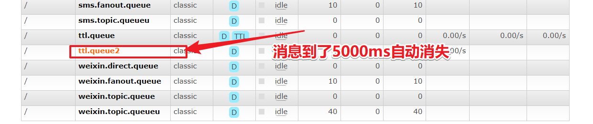

> expiration 字段以微秒为单位表示 TTL 值。且与 x-message-ttl 具有相同的约束条件。因为 expiration 字段必须为字符串类型，broker 将只会接受以字符串形式表达的数字。
> 当同时指定了 queue 和 message 的 TTL 值，则两者中较小的那个才会起作用。

# RabbitMQ高级-消息确认机制的配置

[ 飞哥 ](https://www.kuangstudy.com/user/aaa284f6f98146d4a927e0d42dacb01b) 分类：[学习笔记](https://www.kuangstudy.com/bbs?cid=4) 创建时间：2021/03/05 23:32 [字体](javascript:void(0);) [皮肤](javascript:void(0);)最后修改于： 2021/03/06 00:05

NONE值是禁用发布确认模式，是默认值
CORRELATED值是发布消息成功到交换器后会触发回调方法，如1示例
SIMPLE值经测试有两种效果，其一效果和CORRELATED值一样会触发回调方法，其二在发布消息成功后使用rabbitTemplate调用waitForConfirms或waitForConfirmsOrDie方法等待broker节点返回发送结果，根据返回结果来判定下一步的逻辑，要注意的点是waitForConfirmsOrDie方法如果返回false则会关闭channel，则接下来无法发送消息到broker;

```yaml
# 服务端口
server:
  port: 8080
# 配置rabbitmq服务
spring:
  rabbitmq:
    username: admin
    password: admin
    virtual-host: /
    host: 47.104.141.27
    port: 5672
    publisher-confirm-type: correlated
```

```java
package com.xuexiangban.rabbitmq.springbootorderrabbitmqproducer.callback;
import org.springframework.amqp.rabbit.connection.CorrelationData;
import org.springframework.amqp.rabbit.core.RabbitTemplate;
import org.springframework.stereotype.Component;
/**
 * @description:
 * @author: xuke
 * @time: 2021/3/5 23:25
 */
public class MessageConfirmCallback implements RabbitTemplate.ConfirmCallback {
    @Override
    public void confirm(CorrelationData correlationData, boolean ack, String cause) {
        if(ack){
            System.out.println("消息确认成功!!!!");
        }else{
            System.out.println("消息确认失败!!!!");
        }
    }
}
```

```java
/**
     * @Author xuke
     * @Description 模拟用户购买商品下单的业务
     * @Date 22:26 2021/3/5
     * @Param [userId, productId, num]
     * @return void
     **/
    public void makeOrderTopic(String userId,String productId,int num){
        // 1: 根据商品id查询库存是否充足
        // 2: 保存订单
        String orderId = UUID.randomUUID().toString();
        System.out.println("保存订单成功：id是：" + orderId);
        // 3: 发送消息
        //com.#  duanxin
        //#.email.* email
        //#.sms.# sms
        // 设置消息确认机制
        rabbitTemplate.setConfirmCallback(new MessageConfirmCallback());
        rabbitTemplate.convertAndSend("topic_order_ex","com.email.sms.xxx",orderId);
    }
```


# RabbitMQ高级-死信队列

[ 飞哥 ](https://www.kuangstudy.com/user/aaa284f6f98146d4a927e0d42dacb01b) 分类：[学习笔记](https://www.kuangstudy.com/bbs?cid=4) 创建时间：2021/03/02 20:08 [字体](javascript:void(0);) [皮肤](javascript:void(0);)最后修改于： 2021/03/06 02:04

## 概述

DLX，全称为Dead-Letter-Exchange , 可以称之为死信交换机，也有人称之为死信邮箱。当消息在一个队列中变成死信(dead message)之后，它能被重新发送到另一个交换机中，这个交换机就是DLX ，绑定DLX的队列就称之为死信队列。
消息变成死信，可能是由于以下的原因：

- 消息被拒绝
- 消息过期
- 队列达到最大长度

DLX也是一个正常的交换机，和一般的交换机没有区别，它能在任何的队列上被指定，实际上就是设置某一个队列的属性。当这个队列中存在死信时，Rabbitmq就会自动地将这个消息重新发布到设置的DLX上去，进而被路由到另一个队列，即死信队列。
要想使用死信队列，只需要在定义队列的时候设置队列参数 `x-dead-letter-exchange` 指定交换机即可。


## 在rabbitMQ管理界面中结果

未过期：


过期后：


流程
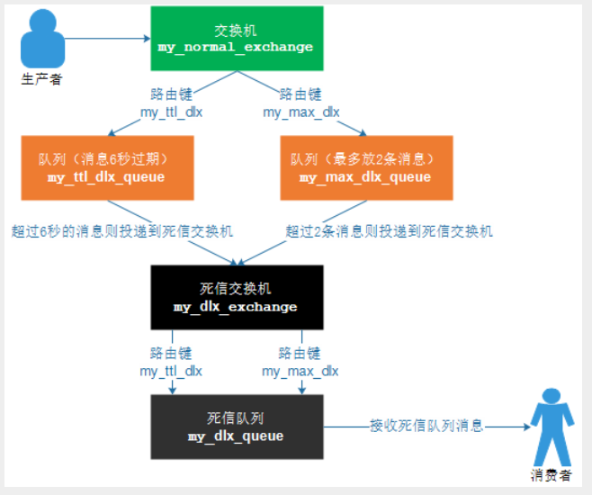

## 消息过期的死信队列测试

# RabbitMQ运维-持久化机制和内存磁盘的监控

[ 飞哥 ](https://www.kuangstudy.com/user/aaa284f6f98146d4a927e0d42dacb01b) 分类：[学习笔记](https://www.kuangstudy.com/bbs?cid=4) 创建时间：2021/03/02 20:06 [字体](javascript:void(0);) [皮肤](javascript:void(0);)最后修改于： 2021/03/06 00:06

## 01、RibbitMQ持久化

持久化就把信息写入到磁盘的过程。

## 02、RabbitMQ持久化消息


把消息默认放在内存中是为了加快传输和消费的速度，存入磁盘是保证消息数据的持久化。

## 03、RabbitMQ非持久化消息

非持久消息：是指当内存不够用的时候，会把消息和数据转移到磁盘，但是重启以后非持久化队列消息就丢失。

## 04、RabbitMQ持久化分类

RabbitMQ的持久化队列分为：
1：队列持久化
2：消息持久化
3：交换机持久化
不论是持久化的消息还是非持久化的消息都可以写入到磁盘中，只不过非持久的是等内存不足的情况下才会被写入到磁盘中。

## 05、RabbitMQ队列持久化的代码实现

队列的持久化是定义队列时的durable参数来实现的，Durable为true时，队列才会持久化。

```java
// 参数1：名字  
// 参数2：是否持久化，
// 参数3：独du占的queue， 
// 参数4：不使用时是否自动删除，
// 参数5：其他参数
channel.queueDeclare(queueName,true,false,false,null);
```

其中参数2：设置为true,就代表的是持久化的含义。即durable=true。持久化的队列在web控制台中有一个`D` 的标记


### 测试步骤

1：可以建立一个临时队列


2：然后重启rabbit-server服务，会发现持久化队列依然在，而非持久队列会丢失。

```bash
systecmctl restart rabbitmq-server
或者
docker restart myrabbit
```

## 06、RabbitMQ消息持久化

消息持久化是通过消息的属性deliveryMode来设置是否持久化，在发送消息时通过basicPublish的参数传入。

```java
// 参数1：交换机的名字
// 参数2：队列或者路由key
// 参数3：是否进行消息持久化
// 参数4：发送消息的内容
channel.basicPublish(exchangeName, routingKey1, MessageProperties.PERSISTENT_TEXT_PLAIN, message.getBytes());
```

## 07、RabbitMQ交换机持久化

和队列一样，交换机也需要在定义的时候设置持久化的标识，否则在rabbit-server服务重启以后将丢失。

```java
// 参数1：交换机的名字
// 参数2：交换机的类型，topic/direct/fanout/headers
// 参数3：是否持久化
channel.exchangeDeclare(exchangeName,exchangeType,true);
```

# RabbitMQ运维-内存磁盘的监控

[ 飞哥 ](https://www.kuangstudy.com/user/aaa284f6f98146d4a927e0d42dacb01b) 分类：[学习笔记](https://www.kuangstudy.com/bbs?cid=4) 创建时间：2021/03/02 20:09 [字体](javascript:void(0);) [皮肤](javascript:void(0);)最后修改于： 2021/03/06 00:07

## 01、RabbitMQ的内存警告

当内存使用超过配置的阈值或者磁盘空间剩余空间对于配置的阈值时，RabbitMQ会暂时阻塞客户端的连接，并且停止接收从客户端发来的消息，以此避免服务器的崩溃，客户端与服务端的心态检测机制也会失效。
如下图：


当出现blocking或blocked话说明到达了阈值和以及高负荷运行了。

## 02、RabbitMQ的内存控制

参考帮助文档：https://www.rabbitmq.com/configure.html
当出现警告的时候，可以通过配置去修改和调整

### 02-1、命令的方式

```bash
rabbitmqctl set_vm_memory_high_watermark <fraction>
rabbitmqctl set_vm_memory_high_watermark absolute 50MB
```

fraction/value 为内存阈值。默认情况是：0.4/2GB，代表的含义是：当RabbitMQ的内存超过40%时，就会产生警告并且阻塞所有生产者的连接。通过此命令修改阈值在Broker重启以后将会失效，通过修改配置文件方式设置的阈值则不会随着重启而消失，但修改了配置文件一样要重启broker才会生效。

分析：

> rabbitmqctl set_vm_memory_high_watermark absolute 50MB


### 02-2、配置文件方式 rabbitmq.conf

> 当前配置文件：/etc/rabbitmq/rabbitmq.conf

```bash
#默认
#vm_memory_high_watermark.relative = 0.4
# 使用relative相对值进行设置fraction,建议取值在04~0.7之间，不建议超过0.7.
vm_memory_high_watermark.relative = 0.6
# 使用absolute的绝对值的方式，但是是KB,MB,GB对应的命令如下
vm_memory_high_watermark.absolute = 2GB
```

## 03、RabbitMQ的内存换页

在某个Broker节点及内存阻塞生产者之前，它会尝试将队列中的消息换页到磁盘以释放内存空间，持久化和非持久化的消息都会写入磁盘中，其中持久化的消息本身就在磁盘中有一个副本，所以在转移的过程中持久化的消息会先从内存中清除掉。

> 默认情况下，内存到达的阈值是50%时就会换页处理。
> 也就是说，在默认情况下该内存的阈值是0.4的情况下，当内存超过0.4*0.5=0.2时，会进行换页动作。

比如有1000MB内存，当内存的使用率达到了400MB,已经达到了极限，但是因为配置的换页内存0.5，这个时候会在达到极限400mb之前，会把内存中的200MB进行转移到磁盘中。从而达到稳健的运行。

可以通过设置 `vm_memory_high_watermark_paging_ratio` 来进行调整

```bash
vm_memory_high_watermark.relative = 0.4
vm_memory_high_watermark_paging_ratio = 0.7（设置小于1的值）
```

为什么设置小于1，以为你如果你设置为1的阈值。内存都已经达到了极限了。你在去换页意义不是很大了。

## 04、RabbitMQ的磁盘预警

当磁盘的剩余空间低于确定的阈值时，RabbitMQ同样会阻塞生产者，这样可以避免因非持久化的消息持续换页而耗尽磁盘空间导致服务器崩溃。

> 默认情况下：磁盘预警为50MB的时候会进行预警。表示当前磁盘空间第50MB的时候会阻塞生产者并且停止内存消息换页到磁盘的过程。
> 这个阈值可以减小，但是不能完全的消除因磁盘耗尽而导致崩溃的可能性。比如在两次磁盘空间的检查空隙内，第一次检查是：60MB ，第二检查可能就是1MB,就会出现警告。

通过命令方式修改如下：

```bash
rabbitmqctl set_disk_free_limit  <disk_limit>
rabbitmqctl set_disk_free_limit memory_limit  <fraction>
disk_limit：固定单位 KB MB GB
fraction ：是相对阈值，建议范围在:1.0~2.0之间。（相对于内存）
```

通过配置文件配置如下：

```
disk_free_limit.relative = 3.0
disk_free_limit.absolute = 50mb
```

# RabbitMQ-高级-集群

[ 飞哥 ](https://www.kuangstudy.com/user/aaa284f6f98146d4a927e0d42dacb01b) 分类：[学习笔记](https://www.kuangstudy.com/bbs?cid=4) 创建时间：2021/03/06 00:07 [字体](javascript:void(0);) [皮肤](javascript:void(0);)最后修改于： 2021/03/06 22:07

## 01、RabbitMQ 集群

RabbitMQ这款消息队列中间件产品本身是基于Erlang编写，Erlang语言天生具备分布式特性（通过同步Erlang集群各节点的magic cookie来实现）。因此，RabbitMQ天然支持Clustering。这使得RabbitMQ本身不需要像ActiveMQ、Kafka那样通过ZooKeeper分别来实现HA方案和保存集群的元数据。集群是保证可靠性的一种方式，同时可以通过水平扩展以达到增加消息吞吐量能力的目的。
在实际使用过程中多采取多机多实例部署方式，为了便于同学们练习搭建，有时候你不得不在一台机器上去搭建一个rabbitmq集群，本章主要针对单机多实例这种方式来进行开展。

> 主要参考官方文档：https://www.rabbitmq.com/clustering.html

## 02、集群搭建

配置的前提是你的rabbitmq可以运行起来，比如”ps aux|grep rabbitmq”你能看到相关进程，又比如运行“rabbitmqctl status”你可以看到类似如下信息，而不报错：

执行下面命令进行查看：

```
ps aux|grep rabbitmq
```

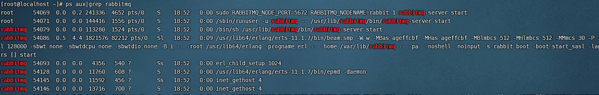

或者

```
systemctl status rabbitmq-server
```

> 注意：确保RabbitMQ可以运行的，确保完成之后，把单机版的RabbitMQ服务停止，后台看不到RabbitMQ的进程为止

## 03、单机多实例搭建

**场景：**假设有两个rabbitmq节点，分别为rabbit-1, rabbit-2，rabbit-1作为主节点，rabbit-2作为从节点。
**启动命令**：RABBITMQ_NODE_PORT=5672 RABBITMQ_NODENAME=rabbit-1 rabbitmq-server -detached
**结束命令**：rabbitmqctl -n rabbit-1 stop

### 03-1、**第一步**：启动第一个节点rabbit-1

```bash
> sudo RABBITMQ_NODE_PORT=5672 RABBITMQ_NODENAME=rabbit-1 rabbitmq-server start &
...............省略...................
  ##########  Logs: /var/log/rabbitmq/rabbit-1.log
  ######  ##        /var/log/rabbitmq/rabbit-1-sasl.log
  ##########
              Starting broker...
 completed with 7 plugins.
```

至此节点rabbit-1启动完成。

### 03-2、启动第二个节点rabbit-2

> 注意：web管理插件端口占用,所以还要指定其web插件占用的端口号
> RABBITMQ_SERVER_START_ARGS=”-rabbitmq_management listener [{port,15673}]”

```bash
sudo RABBITMQ_NODE_PORT=5673 RABBITMQ_SERVER_START_ARGS="-rabbitmq_management listener [{port,15673}]" RABBITMQ_NODENAME=rabbit-2 rabbitmq-server start &
..............省略..................
  ##########  Logs: /var/log/rabbitmq/rabbit-2.log
  ######  ##        /var/log/rabbitmq/rabbit-2-sasl.log
  ##########
              Starting broker...
 completed with 7 plugins.
```

至此节点rabbit-2启动完成

### 03-3、验证启动 “ps aux|grep rabbitmq”

```bash
rabbitmq  2022  2.7  0.4 5349380 77020 ?       Sl   11:03   0:06 /usr/lib/erlang/erts-9.2/bin/beam.smp -W w -A 128 -P 1048576 -t 5000000 -stbt db -zdbbl 128000 -K true -B i -- -root /usr/lib/erlang -progname erl -- -home /var/lib/rabbitmq -- -pa /usr/lib/rabbitmq/lib/rabbitmq_server-3.6.15/ebin -noshell -noinput -s rabbit boot -sname rabbit-1 -boot start_sasl -kernel inet_default_connect_options [{nodelay,true}] -rabbit tcp_listeners [{"auto",5672}] -sasl errlog_type error -sasl sasl_error_logger false -rabbit error_logger {file,"/var/log/rabbitmq/rabbit-1.log"} -rabbit sasl_error_logger {file,"/var/log/rabbitmq/rabbit-1-sasl.log"} -rabbit enabled_plugins_file "/etc/rabbitmq/enabled_plugins" -rabbit plugins_dir "/usr/lib/rabbitmq/plugins:/usr/lib/rabbitmq/lib/rabbitmq_server-3.6.15/plugins" -rabbit plugins_expand_dir "/var/lib/rabbitmq/mnesia/rabbit-1-plugins-expand" -os_mon start_cpu_sup false -os_mon start_disksup false -os_mon start_memsup false -mnesia dir "/var/lib/rabbitmq/mnesia/rabbit-1" -kernel inet_dist_listen_min 25672 -kernel inet_dist_listen_max 25672 start
rabbitmq  2402  4.2  0.4 5352196 77196 ?       Sl   11:05   0:05 /usr/lib/erlang/erts-9.2/bin/beam.smp -W w -A 128 -P 1048576 -t 5000000 -stbt db -zdbbl 128000 -K true -B i -- -root /usr/lib/erlang -progname erl -- -home /var/lib/rabbitmq -- -pa /usr/lib/rabbitmq/lib/rabbitmq_server-3.6.15/ebin -noshell -noinput -s rabbit boot -sname rabbit-2 -boot start_sasl -kernel inet_default_connect_options [{nodelay,true}] -rabbit tcp_listeners [{"auto",5673}] -sasl errlog_type error -sasl sasl_error_logger false -rabbit error_logger {file,"/var/log/rabbitmq/rabbit-2.log"} -rabbit sasl_error_logger {file,"/var/log/rabbitmq/rabbit-2-sasl.log"} -rabbit enabled_plugins_file "/etc/rabbitmq/enabled_plugins" -rabbit plugins_dir "/usr/lib/rabbitmq/plugins:/usr/lib/rabbitmq/lib/rabbitmq_server-3.6.15/plugins" -rabbit plugins_expand_dir "/var/lib/rabbitmq/mnesia/rabbit-2-plugins-expand" -os_mon start_cpu_sup false -os_mon start_disksup false -os_mon start_memsup false -mnesia dir "/var/lib/rabbitmq/mnesia/rabbit-2" -rabbitmq_management listener [{port,15673}] -kernel inet_dist_listen_min 25673 -kernel inet_dist_listen_max 25673 start
```

### 03-4、rabbit-1操作作为主节点

```bash
#停止应用
> sudo rabbitmqctl -n rabbit-1 stop_app
#目的是清除节点上的历史数据（如果不清除，无法将节点加入到集群）
> sudo rabbitmqctl -n rabbit-1 reset
#启动应用
> sudo rabbitmqctl -n rabbit-1 start_app
```

### 03-5、rabbit2操作为从节点

```bash
# 停止应用
> sudo rabbitmqctl -n rabbit-2 stop_app
# 目的是清除节点上的历史数据（如果不清除，无法将节点加入到集群）
> sudo rabbitmqctl -n rabbit-2 reset
# 将rabbit2节点加入到rabbit1（主节点）集群当中【Server-node服务器的主机名】
> sudo rabbitmqctl -n rabbit-2 join_cluster rabbit-1@'Server-node'
# 启动应用
> sudo rabbitmqctl -n rabbit-2 start_app
```

### 03-6、验证集群状态

```bash
> sudo rabbitmqctl cluster_status -n rabbit-1
//集群有两个节点：rabbit-1@Server-node、rabbit-2@Server-node
[{nodes,[{disc,['rabbit-1@Server-node','rabbit-2@Server-node']}]},
 {running_nodes,['rabbit-2@Server-node','rabbit-1@Server-node']},
 {cluster_name,<<"rabbit-1@Server-node.localdomain">>},
 {partitions,[]},
 {alarms,[{'rabbit-2@Server-node',[]},{'rabbit-1@Server-node',[]}]}]
```

### 03-7、Web监控


> 注意在访问的时候：web结面的管理需要给15672 node-1 和15673的node-2 设置用户名和密码。如下:

```bash
rabbitmqctl -n rabbit-1 add_user admin admin
rabbitmqctl -n rabbit-1 set_user_tags admin administrator
rabbitmqctl -n rabbit-1 set_permissions -p / admin ".*" ".*" ".*"
rabbitmqctl -n rabbit-2 add_user admin admin
rabbitmqctl -n rabbit-2 set_user_tags admin administrator
rabbitmqctl -n rabbit-2 set_permissions -p / admin ".*" ".*" ".*"
```

### 03-8、小结

> **Tips：**
> 如果采用多机部署方式，需读取其中一个节点的cookie, 并复制到其他节点（节点之间通过cookie确定相互是否可通信）。cookie存放在/var/lib/rabbitmq/.erlang.cookie。
> 例如：主机名分别为rabbit-1、rabbit-2
> 1、逐个启动各节点
> 2、配置各节点的hosts文件( vim /etc/hosts)
> ​ ip1：rabbit-1
> ​ ip2：rabbit-2
> 其它步骤雷同单机部署方式

# RabbitMQ-高级-分布式事务

[ 飞哥 ](https://www.kuangstudy.com/user/aaa284f6f98146d4a927e0d42dacb01b) 分类：[学习笔记](https://www.kuangstudy.com/bbs?cid=4) 创建时间：2021/03/06 00:07 [字体](javascript:void(0);) [皮肤](javascript:void(0);)最后修改于： 2021/03/07 12:03

## 简述

分布式事务指事务的操作位于不同的节点上，需要保证事务的 AICD 特性。
例如在下单场景下，库存和订单如果不在同一个节点上，就涉及分布式事务。

## 01、分布式事务的方式

在分布式系统中，要实现分布式事务，无外乎那几种解决方案。

### 一、两阶段提交（2PC）需要数据库产商的支持，java组件有atomikos等。

两阶段提交（Two-phase Commit，2PC），通过引入协调者（Coordinator）来协调参与者的行为，并最终决定这些参与者是否要真正执行事务。

#### 准备阶段

协调者询问参与者事务是否执行成功，参与者发回事务执行结果。


1.2 提交阶段
如果事务在每个参与者上都执行成功，事务协调者发送通知让参与者提交事务；否则，协调者发送通知让参与者回滚事务。
需要注意的是，在准备阶段，参与者执行了事务，但是还未提交。只有在提交阶段接收到协调者发来的通知后，才进行提交或者回滚。


#### 存在的问题

- 2.1 同步阻塞 所有事务参与者在等待其它参与者响应的时候都处于同步阻塞状态，无法进行其它操作。
- 2.2 单点问题 协调者在 2PC 中起到非常大的作用，发生故障将会造成很大影响。特别是在阶段二发生故障，所有参与者会一直等待状态，无法完成其它操作。
- 2.3 数据不一致 在阶段二，如果协调者只发送了部分 Commit 消息，此时网络发生异常，那么只有部分参与者接收到 Commit 消息，也就是说只有部分参与者提交了事务，使得系统数据不一致。
- 2.4 太过保守 任意一个节点失败就会导致整个事务失败，没有完善的容错机制。

### 二、补偿事务（TCC） 严选，阿里，蚂蚁金服。

TCC 其实就是采用的补偿机制，其核心思想是：针对每个操作，都要注册一个与其对应的确认和补偿（撤销）操作。它分为三个阶段：

- Try 阶段主要是对业务系统做检测及资源预留
- Confirm 阶段主要是对业务系统做确认提交，Try阶段执行成功并开始执行 Confirm阶段时，默认 - - - Confirm阶段是不会出错的。即：只要Try成功，Confirm一定成功。
- Cancel 阶段主要是在业务执行错误，需要回滚的状态下执行的业务取消，预留资源释放。

> 举个例子，假入 Bob 要向 Smith 转账，思路大概是： 我们有一个本地方法，里面依次调用
> 1：首先在 Try 阶段，要先调用远程接口把 Smith 和 Bob 的钱给冻结起来。
> 2：在 Confirm 阶段，执行远程调用的转账的操作，转账成功进行解冻。
> 3：如果第2步执行成功，那么转账成功，如果第二步执行失败，则调用远程冻结接口对应的解冻方法 (Cancel)。

优点： 跟2PC比起来，实现以及流程相对简单了一些，但数据的一致性比2PC也要差一些
缺点： 缺点还是比较明显的，在2,3步中都有可能失败。TCC属于应用层的一种补偿方式，所以需要程序员在实现的时候多写很多补偿的代码，在一些场景中，一些业务流程可能用TCC不太好定义及处理。

### 三、本地消息表（异步确保）比如：支付宝、微信支付主动查询支付状态，对账单的形式

本地消息表与业务数据表处于同一个数据库中，这样就能利用本地事务来保证在对这两个表的操作满足事务特性，并且使用了消息队列来保证最终一致性。

- 在分布式事务操作的一方完成写业务数据的操作之后向本地消息表发送一个消息，本地事务能保证这个消息一定会被写入本地消息表中。
- 之后将本地消息表中的消息转发到 Kafka 等消息队列中，如果转发成功则将消息从本地消息表中删除，否则继续重新转发。
- 在分布式事务操作的另一方从消息队列中读取一个消息，并执行消息中的操作。


> 优点： 一种非常经典的实现，避免了分布式事务，实现了最终一致性。
> 缺点： 消息表会耦合到业务系统中，如果没有封装好的解决方案，会有很多杂活需要处理。

### 四、MQ 事务消息 异步场景，通用性较强，拓展性较高。

有一些第三方的MQ是支持事务消息的，比如RocketMQ，他们支持事务消息的方式也是类似于采用的二阶段提交，但是市面上一些主流的MQ都是不支持事务消息的，比如 Kafka 不支持。
以阿里的 RabbitMQ 中间件为例，其思路大致为：

- 第一阶段Prepared消息，会拿到消息的地址。 第二阶段执行本地事务，第三阶段通过第一阶段拿到的地址去访问消息，并修改状态。

- 也就是说在业务方法内要想消息队列提交两次请求，一次发送消息和一次确认消息。如果确认消息发送失败了RabbitMQ会定期扫描消息集群中的事务消息，这时候发现了Prepared消息，它会向消息发送者确认，所以生产方需要实现一个check接口，RabbitMQ会根据发送端设置的策略来决定是回滚还是继续发送确认消息。这样就保证了消息发送与本地事务同时成功或同时失败。


优点： 实现了最终一致性，不需要依赖本地数据库事务。
缺点： 实现难度大，主流MQ不支持，RocketMQ事务消息部分代码也未开源。

### 五、总结

通过本文我们总结并对比了几种分布式分解方案的优缺点，分布式事务本身是一个技术难题，是没有一种完美的方案应对所有场景的，具体还是要根据业务场景去抉择吧。阿里RocketMQ去实现的分布式事务，现在也有除了很多分布式事务的协调器，比如LCN等，大家可以多去尝试。

## 02、具体实现

分布式事务的完整架构图


美团外卖架构：


### 2-01、系统与系统之间的分布式事务问题


### 2-02、系统间调用过程中事务回滚问题

```java
package com.xuexiangban.rabbitmq.service;
import com.xuexiangban.rabbitmq.dao.OrderDataBaseService;
import com.xuexiangban.rabbitmq.pojo.Order;
import org.springframework.beans.factory.annotation.Autowired;
import org.springframework.http.client.SimpleClientHttpRequestFactory;
import org.springframework.stereotype.Service;
import org.springframework.transaction.annotation.Transactional;
import org.springframework.web.client.RestTemplate;
@Service
public class OrderService {
    @Autowired
    private OrderDataBaseService orderDataBaseService;
    // 创建订单
    @Transactional(rollbackFor = Exception.class) // 订单创建整个方法添加事务
    public void createOrder(Order orderInfo) throws Exception {
        // 1: 订单信息--插入丁订单系统，订单数据库事务
        orderDataBaseService.saveOrder(orderInfo);
        // 2：通過Http接口发送订单信息到运单系统
        String result = dispatchHttpApi(orderInfo.getOrderId());
        if(!"success".equals(result)) {
            throw new Exception("订单创建失败,原因是运单接口调用失败!");
        }
    }
    /**
     *  模拟http请求接口发送，运单系统，将订单号传过去 springcloud
     * @return
     */
    private String dispatchHttpApi(String orderId) {
        SimpleClientHttpRequestFactory factory  = new SimpleClientHttpRequestFactory();
        // 链接超时 > 3秒
        factory.setConnectTimeout(3000);
        // 处理超时 > 2秒
        factory.setReadTimeout(2000);
        // 发送http请求
        String url = "http://localhost:9000/dispatch/order?orderId="+orderId;
        RestTemplate restTemplate = new RestTemplate(factory);//异常
        String result = restTemplate.getForObject(url, String.class);
        return result;
    }
}
```

### 2-03、基于MQ的分布式事务整体设计思路

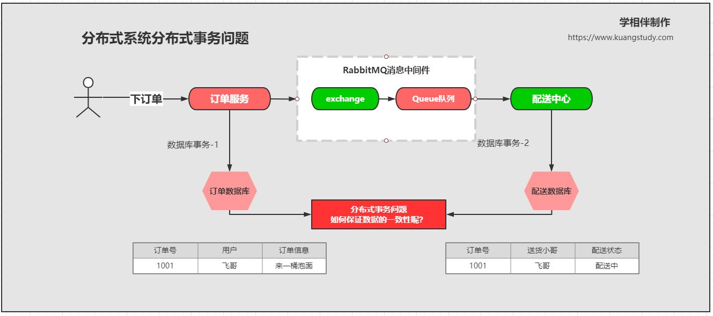

### 2-04、基于MQ的分布式事务消息的可靠生产问题


如果这个时候MQ服务器出现了异常和故障，那么消息是无法获取到回执信息。怎么解决呢？r

#### 2-04-01、基于MQ的分布式事务消息的可靠生产问题-定时重发


### 2-06、基于MQ的分布式事务消息的可靠消费


### 2-07、基于MQ的分布式事务消息的消息重发

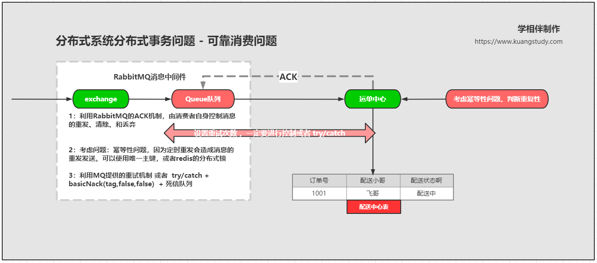

### 2-08、基于MQ的分布式事务消息的死信队列消息转移 + 人工处理


如果死信队列报错就进行人工处理

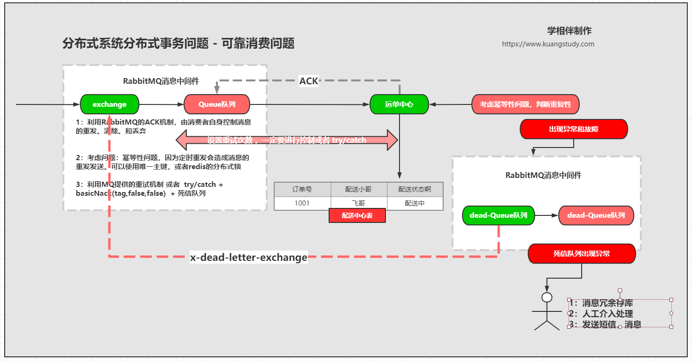

### 2-09、基于MQ的分布式事务消息的死信队列消息重试注意事项

### 2-10、基于MQ的分布式事务消息的定式重发

## 03、总结

### 基于MQ的分布式事务解决方案优点：

1、通用性强
2、拓展方便
3、耦合度低，方案也比较成熟

### 基于MQ的分布式事务解决方案缺点：

1、基于消息中间件，只适合异步场景
2、消息会延迟处理，需要业务上能够容忍

### 建议

1、尽量去避免分布式事务
2、尽量将非核心业务做成异步

# Springboot整合rabbitmq集群配置详解

[ 飞哥 ](https://www.kuangstudy.com/user/aaa284f6f98146d4a927e0d42dacb01b) 分类：[学习笔记](https://www.kuangstudy.com/bbs?cid=4) 创建时间：2021/03/06 21:59 [字体](javascript:void(0);) [皮肤](javascript:void(0);)最后修改于： 2021/03/06 22:07

pringboot整合rabbitmq
集群创建方式这里省略
整合开始
1 引入starter

```xml
<parent>
    <groupId>org.springframework.boot</groupId>
    <artifactId>spring-boot-starter-parent</artifactId>
    <version>2.2.6.RELEASE</version>
    <relativePath/> <!-- lookup parent from repository -->
</parent>
<dependency>
    <groupId>org.springframework.boot</groupId>
    <artifactId>spring-boot-starter-amqp</artifactId>
</dependency>
```

2：详细配置如下

```yaml
 rabbitmq:
    addresses: 127.0.0.1:6605,127.0.0.1:6606,127.0.0.1:6705 #指定client连接到的server的地址，多个以逗号分隔(优先取addresses，然后再取host)
#    port:
    ##集群配置 addresses之间用逗号隔开
    # addresses: ip:port,ip:port
    password: admin
    username: 123456
    virtual-host: / # 连接到rabbitMQ的vhost
    requested-heartbeat: #指定心跳超时，单位秒，0为不指定；默认60s
    publisher-confirms: #是否启用 发布确认
    publisher-reurns: # 是否启用发布返回
    connection-timeout: #连接超时，单位毫秒，0表示无穷大，不超时
    cache:
      channel.size: # 缓存中保持的channel数量
      channel.checkout-timeout: # 当缓存数量被设置时，从缓存中获取一个channel的超时时间，单位毫秒；如果为0，则总是创建一个新channel
      connection.size: # 缓存的连接数，只有是CONNECTION模式时生效
      connection.mode: # 连接工厂缓存模式：CHANNEL 和 CONNECTION
    listener:
      simple.auto-startup: # 是否启动时自动启动容器
      simple.acknowledge-mode: # 表示消息确认方式，其有三种配置方式，分别是none、manual和auto；默认auto
      simple.concurrency: # 最小的消费者数量
      simple.max-concurrency: # 最大的消费者数量
      simple.prefetch: # 指定一个请求能处理多少个消息，如果有事务的话，必须大于等于transaction数量.
      simple.transaction-size: # 指定一个事务处理的消息数量，最好是小于等于prefetch的数量.
      simple.default-requeue-rejected: # 决定被拒绝的消息是否重新入队；默认是true（与参数acknowledge-mode有关系）
      simple.idle-event-interval: # 多少长时间发布空闲容器时间，单位毫秒
      simple.retry.enabled: # 监听重试是否可用
      simple.retry.max-attempts: # 最大重试次数
      simple.retry.initial-interval: # 第一次和第二次尝试发布或传递消息之间的间隔
      simple.retry.multiplier: # 应用于上一重试间隔的乘数
      simple.retry.max-interval: # 最大重试时间间隔
      simple.retry.stateless: # 重试是有状态or无状态
    template:
      mandatory: # 启用强制信息；默认false
      receive-timeout: # receive() 操作的超时时间
      reply-timeout: # sendAndReceive() 操作的超时时间
      retry.enabled: # 发送重试是否可用
      retry.max-attempts: # 最大重试次数
      retry.initial-interval: # 第一次和第二次尝试发布或传递消息之间的间隔
      retry.multiplier: # 应用于上一重试间隔的乘数
      retry.max-interval: #最大重试时间间隔
```

> 注：相关配置很多，大家只需要关注一些常用的配置即可

对于发送方而言，需要做以下配置：
1 配置CachingConnectionFactory
2 配置Exchange/Queue/Binding
3 配置RabbitAdmin创建上一步的Exchange/Queue/Binding
4 配置RabbitTemplate用于发送消息，RabbitTemplate通过CachingConnectionFactory获取到Connection，然后想指定Exchange发送
对于消费方而言，需要做以下配置：
1 配置CachingConnectionFactory
2 配置Exchange/Queue/Binding
3 配置RabbitAdmin创建上一步的Exchange/Queue/Binding
4 配置RabbitListenerContainerFactory
5 配置[@RabbitListener](https://github.com/RabbitListener)/[@RabbitHandler](https://github.com/RabbitHandler)用于接收消息
在默认情况下主要的配置如下：

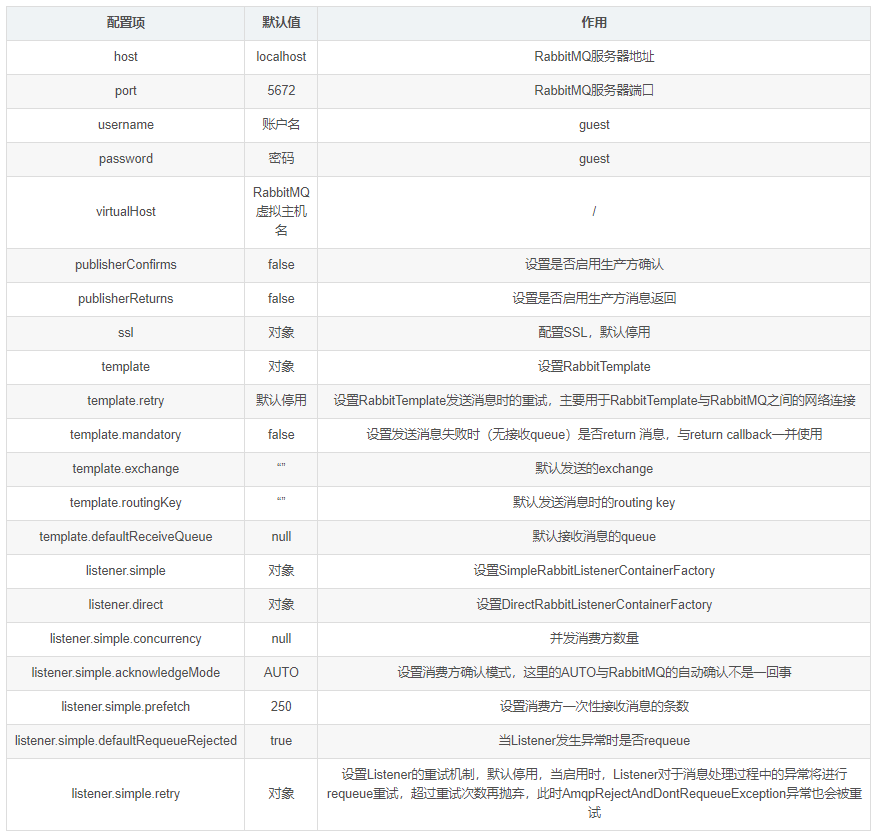

3 Spring AMQP的主要对象
注：如果不了解AMQP请前往官网了解.


4 使用：
通过配置类加载的方式：

```java
package com.yd.demo.config;
import org.slf4j.Logger;
import org.slf4j.LoggerFactory;
import org.springframework.amqp.core.AcknowledgeMode;
import org.springframework.amqp.core.Binding;
import org.springframework.amqp.core.BindingBuilder;
import org.springframework.amqp.core.DirectExchange;
import org.springframework.amqp.core.Queue;
import org.springframework.amqp.core.TopicExchange;
import org.springframework.amqp.rabbit.config.SimpleRabbitListenerContainerFactory;
import org.springframework.amqp.rabbit.connection.CachingConnectionFactory;
import org.springframework.amqp.rabbit.connection.ConnectionFactory;
import org.springframework.amqp.rabbit.core.RabbitAdmin;
import org.springframework.amqp.rabbit.core.RabbitTemplate;
import org.springframework.amqp.rabbit.listener.RabbitListenerContainerFactory;
import org.springframework.amqp.support.converter.Jackson2JsonMessageConverter;
import org.springframework.beans.factory.annotation.Autowired;
import org.springframework.beans.factory.annotation.Value;
import org.springframework.context.annotation.Bean;
import org.springframework.context.annotation.Configuration;
import java.util.HashMap;
import java.util.Map;
@Configuration
public class RabbitConfig {
    private static final Logger logger = LoggerFactory.getLogger(RabbitConfig.class);
    public static final String RECEIVEDLXEXCHANGE="spring-ex";
    public static final String RECEIVEDLXQUEUE="spring-qu1";
    public static final String RECEIVEDLXROUTINGKEY="aa";
    public static final String DIRECTEXCHANGE="spring-ex";
    public static final String MDMQUEUE="mdmQueue";
    public static final String TOPICEXCHANGE="spring-top";
    @Value("${spring.rabbitmq.addresses}")
    private String hosts;
    @Value("${spring.rabbitmq.username}")
    private String userName;
    @Value("${spring.rabbitmq.password}")
    private String password;
    @Value("${spring.rabbitmq.virtual-host}")
    private String virtualHost;
 /*   @Value("${rabbit.channelCacheSize}")
    private int channelCacheSize;*/
//    @Value("${rabbit.port}")
//    private int port;
/*    @Autowired
    private ConfirmCallBackListener confirmCallBackListener;
    @Autowired
    private ReturnCallBackListener returnCallBackListener;*/
    @Bean
    public ConnectionFactory connectionFactory(){
        CachingConnectionFactory cachingConnectionFactory = new CachingConnectionFactory();
        cachingConnectionFactory.setAddresses(hosts);
        cachingConnectionFactory.setUsername(userName);
        cachingConnectionFactory.setPassword(password);
//        cachingConnectionFactory.setChannelCacheSize(channelCacheSize);
        //cachingConnectionFactory.setPort(port);
        cachingConnectionFactory.setVirtualHost(virtualHost);
        //设置连接工厂缓存模式：
        cachingConnectionFactory.setCacheMode(CachingConnectionFactory.CacheMode.CONNECTION);
        //缓存连接数
        cachingConnectionFactory.setConnectionCacheSize(3);
        //设置连接限制
        cachingConnectionFactory.setConnectionLimit(6);
        logger.info("连接工厂设置完成，连接地址{}"+hosts);
        logger.info("连接工厂设置完成，连接用户{}"+userName);
        return cachingConnectionFactory;
    }
    @Bean
    public RabbitAdmin rabbitAdmin(){
        RabbitAdmin rabbitAdmin = new RabbitAdmin(connectionFactory());
        rabbitAdmin.setAutoStartup(true);
        rabbitAdmin.setIgnoreDeclarationExceptions(true);
        rabbitAdmin.declareBinding(bindingMdmQueue());
        //声明topic交换器
        rabbitAdmin.declareExchange(directExchange());
        logger.info("管理员设置完成");
        return rabbitAdmin;
    }
    @Bean
    public RabbitListenerContainerFactory listenerContainerFactory() {
        SimpleRabbitListenerContainerFactory factory = new SimpleRabbitListenerContainerFactory();
        factory.setConnectionFactory(connectionFactory());
        factory.setMessageConverter(new Jackson2JsonMessageConverter());
        //最小消费者数量
        factory.setConcurrentConsumers(10);
        //最大消费者数量
        factory.setMaxConcurrentConsumers(10);
        //一个请求最大处理的消息数量
        factory.setPrefetchCount(10);
        //
        factory.setChannelTransacted(true);
        //默认不排队
        factory.setDefaultRequeueRejected(true);
        //手动确认接收到了消息
        factory.setAcknowledgeMode(AcknowledgeMode.MANUAL);
        logger.info("监听者设置完成");
        return factory;
    }
    @Bean
    public DirectExchange directExchange(){
        return new DirectExchange(DIRECTEXCHANGE,true,false);
    }
    @Bean
    public Queue mdmQueue(){
        Map arguments = new HashMap<>();
        // 绑定该队列到私信交换机
        arguments.put("x-dead-letter-exchange",RECEIVEDLXEXCHANGE);
        arguments.put("x-dead-letter-routing-key",RECEIVEDLXROUTINGKEY);
        logger.info("队列交换机绑定完成");
        return new Queue(RECEIVEDLXQUEUE,true,false,false,arguments);
    }
    @Bean
    Binding bindingMdmQueue() {
        return BindingBuilder.bind(mdmQueue()).to(directExchange()).with("");
    }
    @Bean
    public RabbitTemplate rabbitTemplate(){
        RabbitTemplate rabbitTemplate = new RabbitTemplate(connectionFactory());
        rabbitTemplate.setMandatory(true);
        //发布确认
//        rabbitTemplate.setConfirmCallback(confirmCallBackListener);
        // 启用发布返回
//        rabbitTemplate.setReturnCallback(returnCallBackListener);
        logger.info("连接模板设置完成");
        return rabbitTemplate;
    }
  /*  @Bean
    public TopicExchange topicExchange(){
        return new TopicExchange(TOPICEXCHANGE,true,false);
    }*/
  /*
*//**
     * @return DirectExchange
     *//*
    @Bean
    public DirectExchange dlxExchange() {
        return new DirectExchange(RECEIVEDLXEXCHANGE,true,false);
    }
*//*
*
     * @return Queue
*//*
    @Bean
    public Queue dlxQueue() {
        return new Queue(RECEIVEDLXQUEUE,true);
    }
*//*
     * @return Binding
     *//*
    @Bean
    public Binding binding() {
        return BindingBuilder.bind(dlxQueue()).to(dlxExchange()).with(RECEIVEDLXROUTINGKEY);
    }*/
}
```

通过两种方式加载
1 通过配置文件
2 通过配置类
说明：上面是通过配置文件与配置类的方式去加载,常用的配置如上所示。实际使用中要生产方与消费方要分开配置，相关配置也会有小变动，大体配置不变。更多信息可查看官网配置。

# RabbitMQ-集群监控

[ 飞哥 ](https://www.kuangstudy.com/user/aaa284f6f98146d4a927e0d42dacb01b) 分类：[学习笔记](https://www.kuangstudy.com/bbs?cid=4) 创建时间：2021/03/06 22:00 [字体](javascript:void(0);) [皮肤](javascript:void(0);)最后修改于： 2021/03/06 22:07

## 集群监控

在广大的互联网行业中RabbitMQ几乎都会有集群,那么对于集群的监控就成了企业生态中必不可少的一环。接下来我们来将讲解主要的4种监控。

## 1、管理界面监控

> 管理界面监控需要我们开启对应的插件(rabbitmq-plugins enable rabbitmq_management)
> 然后访问[http://ip:15672](http://ip:15672/)


> 在管理控制台我们就可以直观的看到集群中的每一个节点是否正常,如果为红色则表示节点挂掉了,同时可以很方便的查看到各个节点的内存、磁盘等相关的信息，使用起来也是非常方便的。但是遗憾的该功能做的比较简陋,没有告警等一些列的个性化设置,同时如果想把他接入到公司其他的监控系统统一管理也是很难做到的,所以扩展性不强，一般在小型企业的小集群中使用。

## 2、tracing日志监控

> 对于企业级的应用开发来讲,我们通常都会比较关注我们的消息,甚至很多的场景把消息的可靠性放在第一位,但是我们的MQ集群难免会出现消息异常丢失或者客户端无法发送消息等异常情况,此时为了帮助开发人员快速的定位问题,我们就可以对消息的投递和消费过程进行监控,而tracing日志监控插件帮我们很好的实现了该功能
> 消息中心的消息追踪需要使用Trace实现，Trace是Rabbitmq用于记录每一次发送的消息，方便使用Rabbitmq的开发者调试、排错。可通过插件形式提供可视化界面。Trace启动后会自动创建系统Exchange：amq.rabbitmq.trace ,每个队列会自动绑定该Exchange，绑定后发送到队列的消息都会记录到Trace日志。

### 消息追踪启用与查看

以下是trace的相关命令和使用（要使用需要先rabbitmq启用插件，再打开开关才能使用）：

| 命令集                                        | 描述                                         |
| --------------------------------------------- | -------------------------------------------- |
| rabbitmq-plugins list                         | 查看插件列表                                 |
| rabbitmq-plugins enable rabbitmq_tracing      | rabbitmq启用trace插件                        |
| rabbitmqctl trace_on                          | 打开trace的开关                              |
| rabbitmqctl trace_on -p itcast                | 打开trace的开关(itcast为需要日志追踪的vhost) |
| rabbitmqctl trace_off                         | 关闭trace的开关                              |
| rabbitmq-plugins disable rabbitmq_tracing     | rabbitmq关闭Trace插件                        |
| rabbitmqctl set_user_tags heima administrator | 只有administrator的角色才能查看日志界面      |

安装插件并开启 trace_on 之后，会发现多个 exchange：amq.rabbitmq.trace ，类型为：topic。


## 2、日志追踪

1、发送消息

```
rabbitTemplate.convertAndSend("spring_queue", "只发队列spring_queue的消息--01。");
```

2、查看trace


点击Tracing查看Trace log files

3、点击Tracing查看Trace log files
4、点击xuexiangban-trace.log确认消息轨迹正确性


## 3、定制自己的监控系统

> RabbitMQ提供了很丰富的restful风格的api接口,我们可以通过这些接口得到对应的集群数据,此时我们就可以定制我们的监控系统。

| **HTTP API URL**                      | **HTTP 请求类型** | **接口含义**                                                 |
| ------------------------------------- | ----------------- | ------------------------------------------------------------ |
| /api/connections                      | GET               | 获取当前RabbitMQ集群下所有打开的连接                         |
| /api/nodes                            | GET               | 获取当前RabbitMQ集群下所有节点实例的状态信息                 |
| /api/vhosts/{vhost}/connections       | GET               | 获取某一个虚拟机主机下的所有打开的connection连接             |
| /api/connections/{name}/channels      | GET               | 获取某一个连接下所有的管道信息                               |
| /api/vhosts/{vhost}/channels          | GET               | 获取某一个虚拟机主机下的管道信息                             |
| /api/consumers/{vhost}                | GET               | 获取某一个虚拟机主机下的所有消费者信息                       |
| /api/exchanges/{vhost}                | GET               | 获取某一个虚拟机主机下面的所有交换器信息                     |
| /api/queues/{vhost}                   | GET               | 获取某一个虚拟机主机下的所有队列信息                         |
| /api/users                            | GET               | 获取集群中所有的用户信息                                     |
| /api/users/{name}                     | GET/PUT/DELETE    | 获取/更新/删除指定用户信息                                   |
| /api/users/{user}/permissions         | GET               | 获取当前指定用户的所有权限信息                               |
| /api/permissions/{vhost}/{user}       | GET/PUT/DELETE    | 获取/更新/删除指定虚拟主机下特定用户的权限                   |
| /api/exchanges/{vhost}/{name}/publish | POST              | 在指定的虚拟机主机和交换器上发布一个消息                     |
| /api/queues/{vhost}/{name}/get        | POST              | 在指定虚拟机主机和队列名中获取消息，同时该动作会修改队列状态 |
| /api/healthchecks/node/{node}         | GET               | 获取指定节点的健康检查状态                                   |

> 更多API的相关信息和描述可以访问http://ip:15672/api/


> 接下来我们使用RabbitMQ Http API接口来获取集群监控数据

1. HttpClient以及Jackson的相关Jar

   ```xml
   <dependency>
       <groupId>org.apache.httpcomponents</groupId>
       <artifactId>httpclient</artifactId>
       <version>4.3.6</version>
   </dependency>
   <dependency>
    <groupId>com.fasterxml.jackson.core</groupId>
    <artifactId>jackson-databind</artifactId>
    <version>2.7.4</version>
   </dependency>
   <dependency>
    <groupId>com.fasterxml.jackson.core</groupId>
    <artifactId>jackson-annotations</artifactId>
    <version>2.7.4</version>
   </dependency>
   <dependency>
    <groupId>com.fasterxml.jackson.core</groupId>
    <artifactId>jackson-core</artifactId>
    <version>2.7.4</version>
   </dependency>
   ```

2. 创建MonitorRabbitMQ类实现具体的代码

   ```java
   package com.xuexiangban.rabbitmq;
   import com.fasterxml.jackson.databind.DeserializationFeature;
   import com.fasterxml.jackson.databind.JsonNode;
   import com.fasterxml.jackson.databind.ObjectMapper;
   import org.apache.http.HttpEntity;
   import org.apache.http.auth.UsernamePasswordCredentials;
   import org.apache.http.client.methods.CloseableHttpResponse;
   import org.apache.http.client.methods.HttpGet;
   import org.apache.http.impl.auth.BasicScheme;
   import org.apache.http.impl.client.CloseableHttpClient;
   import org.apache.http.impl.client.HttpClients;
   import org.apache.http.util.EntityUtils;
   import java.io.IOException;
   import java.util.HashMap;
   import java.util.Iterator;
   import java.util.Map;
   /**
    * RabbitMQ的监控
    */
   public class MonitorRabbitMQ {
       //RabbitMQ的HTTP API——获取集群各个实例的状态信息，ip替换为自己部署相应实例的
       private static String RABBIT_NODES_STATUS_REST_URL = "http://192.168.13.111:15672/api/nodes";
       //RabbitMQ的HTTP API——获取集群用户信息，ip替换为自己部署相应实例的
       private static String RABBIT_USERS_REST_URL = "http://192.168.13.111:15672/api/users";
       //rabbitmq的用户名
       private static String RABBIT_USER_NAME = "guest";
       //rabbitmq的密码
       private static String RABBIT_USER_PWD = "guest";
       public static void main(String[] args) {
           try {
               //step1.获取rabbitmq集群各个节点实例的状态信息
               Map<String, ClusterStatus> clusterMap =
                       fetchRabbtMQClusterStatus(RABBIT_NODES_STATUS_REST_URL, RABBIT_USER_NAME, RABBIT_USER_PWD);
               //step2.打印输出各个节点实例的状态信息
               for (Map.Entry entry : clusterMap.entrySet()) {
                   System.out.println(entry.getKey() + " : " + entry.getValue());
               }
               //step3.获取rabbitmq集群用户信息
               Map<String, User> userMap =
                       fetchRabbtMQUsers(RABBIT_USERS_REST_URL, RABBIT_USER_NAME, RABBIT_USER_PWD);
               //step4.打印输出rabbitmq集群用户信息
               for (Map.Entry entry : userMap.entrySet()) {
                   System.out.println(entry.getKey() + " : " + entry.getValue());
               }
           } catch (IOException e) {
               e.printStackTrace();
           }
       }
       public static Map<String, ClusterStatus> fetchRabbtMQClusterStatus(String url, String username, String password) throws IOException {
           Map<String, ClusterStatus> clusterStatusMap = new HashMap<String, ClusterStatus>();
           String nodeData = getData(url, username, password);
           JsonNode jsonNode = null;
           try {
               jsonNode = JsonUtil.toJsonNode(nodeData);
           } catch (IOException e) {
               e.printStackTrace();
           }
           Iterator<JsonNode> iterator = jsonNode.iterator();
           while (iterator.hasNext()) {
               JsonNode next = iterator.next();
               ClusterStatus status = new ClusterStatus();
               status.setDiskFree(next.get("disk_free").asLong());
               status.setFdUsed(next.get("fd_used").asLong());
               status.setMemoryUsed(next.get("mem_used").asLong());
               status.setProcUsed(next.get("proc_used").asLong());
               status.setSocketUsed(next.get("sockets_used").asLong());
               clusterStatusMap.put(next.get("name").asText(), status);
           }
           return clusterStatusMap;
       }
       public static Map<String, User> fetchRabbtMQUsers(String url, String username, String password) throws IOException {
           Map<String, User> userMap = new HashMap<String, User>();
           String nodeData = getData(url, username, password);
           JsonNode jsonNode = null;
           try {
               jsonNode = JsonUtil.toJsonNode(nodeData);
           } catch (IOException e) {
               e.printStackTrace();
           }
           Iterator<JsonNode> iterator = jsonNode.iterator();
           while (iterator.hasNext()) {
               JsonNode next = iterator.next();
               User user = new User();
               user.setName(next.get("name").asText());
               user.setTags(next.get("tags").asText());
               userMap.put(next.get("name").asText(), user);
           }
           return userMap;
       }
       public static String getData(String url, String username, String password) throws IOException {
           CloseableHttpClient httpClient = HttpClients.createDefault();
           UsernamePasswordCredentials creds = new UsernamePasswordCredentials(username, password);
           HttpGet httpGet = new HttpGet(url);
           httpGet.addHeader(BasicScheme.authenticate(creds, "UTF-8", false));
           httpGet.setHeader("Content-Type", "application/json");
           CloseableHttpResponse response = httpClient.execute(httpGet);
           try {
               if (response.getStatusLine().getStatusCode() != 200) {
                   System.out.println("call http api to get rabbitmq data return code: " + response.getStatusLine().getStatusCode() + ", url: " + url);
               }
               HttpEntity entity = response.getEntity();
               if (entity != null) {
                   return EntityUtils.toString(entity);
               }
           } finally {
               response.close();
           }
           return null;
       }
       public static class JsonUtil {
           private static ObjectMapper objectMapper = new ObjectMapper();
           static {
               objectMapper.disable(DeserializationFeature.FAIL_ON_UNKNOWN_PROPERTIES);
               //objectMapper.disable(SerializationFeature.FAIL_ON_EMPTY_BEANS);
           }
           public static JsonNode toJsonNode(String jsonString) throws IOException {
               return objectMapper.readTree(jsonString);
           }
       }
       public static class User {
           private String name;
           private String tags;
           @Override
           public String toString() {
               return "User{" +
                       "name=" + name +
                       ", tags=" + tags +
                       '}';
           }
           //GET/SET方法省略
           public String getName() {
               return name;
           }
           public void setName(String name) {
               this.name = name;
           }
           public String getTags() {
               return tags;
           }
           public void setTags(String tags) {
               this.tags = tags;
           }
       }
       public static class ClusterStatus {
           private long diskFree;
           private long diskLimit;
           private long fdUsed;
           private long fdTotal;
           private long socketUsed;
           private long socketTotal;
           private long memoryUsed;
           private long memoryLimit;
           private long procUsed;
           private long procTotal;
           // 此处省略了Getter和Setter方法
           public long getDiskFree() {
               return diskFree;
           }
           public void setDiskFree(long diskFree) {
               this.diskFree = diskFree;
           }
           public long getDiskLimit() {
               return diskLimit;
           }
           public void setDiskLimit(long diskLimit) {
               this.diskLimit = diskLimit;
           }
           public long getFdUsed() {
               return fdUsed;
           }
           public void setFdUsed(long fdUsed) {
               this.fdUsed = fdUsed;
           }
           public long getFdTotal() {
               return fdTotal;
           }
           public void setFdTotal(long fdTotal) {
               this.fdTotal = fdTotal;
           }
           public long getSocketUsed() {
               return socketUsed;
           }
           public void setSocketUsed(long socketUsed) {
               this.socketUsed = socketUsed;
           }
           public long getSocketTotal() {
               return socketTotal;
           }
           public void setSocketTotal(long socketTotal) {
               this.socketTotal = socketTotal;
           }
           public long getMemoryUsed() {
               return memoryUsed;
           }
           public void setMemoryUsed(long memoryUsed) {
               this.memoryUsed = memoryUsed;
           }
           public long getMemoryLimit() {
               return memoryLimit;
           }
           public void setMemoryLimit(long memoryLimit) {
               this.memoryLimit = memoryLimit;
           }
           public long getProcUsed() {
               return procUsed;
           }
           public void setProcUsed(long procUsed) {
               this.procUsed = procUsed;
           }
           public long getProcTotal() {
               return procTotal;
           }
           public void setProcTotal(long procTotal) {
               this.procTotal = procTotal;
           }
           @Override
           public String toString() {
               return "ClusterStatus{" +
                       "diskFree=" + diskFree +
                       ", diskLimit=" + diskLimit +
                       ", fdUsed=" + fdUsed +
                       ", fdTotal=" + fdTotal +
                       ", socketUsed=" + socketUsed +
                       ", socketTotal=" + socketTotal +
                       ", memoryUsed=" + memoryUsed +
                       ", memoryLimit=" + memoryLimit +
                       ", procUsed=" + procUsed +
                       ", procTotal=" + procTotal +
                       '}';
           }
       }
   }
   ```

3. 启动测试


## 4、Zabbix 监控RabbitMQ

> Zabbix是一个基于WEB界面提供分布式系统监视以及网络监视功能的企业级开源解决方案,他也可以帮助我们搭建一个MQ集群的监控系统,同时提供预警等功能，但是由于其搭建配置要求比较高一般都是由运维人员负责搭建,感兴趣的同学可以访问https://www.zabbix.com/ 官网进行了解学习。

# RabbitMQ面试题分析

**面试题：1、Rabbitmq 为什么需要信道，为什么不是TCP直接通信**

> 1、TCP的创建和销毁，开销大，创建要三次握手，销毁要4次分手。
>
> 2、如果不用信道，那应用程序就会TCP连接到Rabbit服务器，高峰时每秒成千上万连接就会造成资源的巨大浪费，而且==底层操作系统每秒处理tcp连接数也是有限制的，==必定造成性能瓶颈。
>
> 3、信道的原理是一条线程一条信道，多条线程多条信道同用一条TCP连接，一条TCP连接可以容纳无限的信道，即使每秒成千上万的请求也不会成为性能瓶颈。

**2：queue队列到底在消费者创建还是生产者创建？**

> 1： 一般建议是在rabbitmq操作面板创建。这是一种稳妥的做法。
> 2：按照常理来说，确实应该消费者这边创建是最好，消息的消费是在这边。这样你承受一个后果，可能我生产在生产消息可能会丢失消息。
> 3：在生产者创建队列也是可以，这样稳妥的方法，消息是不会出现丢失。
> 4：如果你生产者和消费都创建的队列，谁先启动谁先创建，后面启动就覆盖前面的